# Client Intelligence Agent — Implementation Roadmap

**Agent ID:** 05  
**Canonical product name:** Client Intelligence Agent  
**Source section label:** Client Interaction Agent / Client Transparency Intelligence  
**Document version:** 1.0  
**Last updated:** 2026-07-23
**Status:** Active implementation; core evidence, internal dashboard, client portal, reports, and grounded Q&A are implemented

**Authoritative source:** `BSG_Ops_Intelligence_Agent_Optimized v1.0 (1).docx`, SHA-256 `52DF83E2BA8CBCB8E9481B6EF7E4D7C1CB404373050E456F8A6C0AA8E1A9F6C6`.

**Related repository documents:**

- Existing derived specification: [`docs/AI Agents/05. Client Interaction Agent.md`](../AI%20Agents/05.%20Client%20Interaction%20Agent.md)
- Product requirements: [`docs/02. Product Requirements.md`](../02.%20Product%20Requirements.md)
- Platform roadmap: [`docs/04. Roadmap.md`](../04.%20Roadmap.md)
- Technical workflow: [`docs/06. Technical Workflow.md`](../06.%20Technical%20Workflow.md)
- API specification: [`docs/09. API Specification.md`](../09.%20API%20Specification.md)
- Database schema: [`docs/10. DB Schema.md`](../10.%20DB%20Schema.md)
- AI and RAG architecture: [`docs/11. AI & RAG Architecture.md`](../11.%20AI%20&%20RAG%20Architecture.md)
- Security and compliance: [`docs/13. Security & Compliance.md`](../13.%20Security%20&%20Compliance.md)
- Agent communication graph: [`docs/17. Agent Communication Graph.md`](../17.%20Agent%20Communication%20Graph.md)

---

## Table of Contents

1. [Executive Summary](#1-executive-summary)
2. [Mandate, Scope, and Boundaries](#2-mandate-scope-and-boundaries)
3. [Current Codebase Starting Point](#3-current-codebase-starting-point)
4. [Requirement Traceability Register](#4-requirement-traceability-register)
5. [Roadmap Phases Overview](#5-roadmap-phases-overview)
6. [Phase 0 — Product Contract and Safety Boundaries](#6-phase-0--product-contract-and-safety-boundaries)
7. [Phase 1 — Governed Data and Evidence Foundation](#7-phase-1--governed-data-and-evidence-foundation)
8. [Phase 2 — Core Client Intelligence Engines](#8-phase-2--core-client-intelligence-engines)
9. [Phase 3 — Readiness and Guidance Intelligence](#9-phase-3--readiness-and-guidance-intelligence)
10. [Phase 4 — Narratives, Reports, and Approval Workflow](#10-phase-4--narratives-reports-and-approval-workflow)
11. [Phase 5 — Dashboard and Conversational Experience](#11-phase-5--dashboard-and-conversational-experience)
12. [Phase 6 — Connected Agent, Automation, and Pilot Hardening](#12-phase-6--connected-agent-automation-and-pilot-hardening)
13. [Phase 7 — Future Portfolio and Relationship Intelligence](#13-phase-7--future-portfolio-and-relationship-intelligence)
14. [Data Model Evolution](#14-data-model-evolution)
15. [API Surface](#15-api-surface)
16. [Inter-Agent Integration Plan](#16-inter-agent-integration-plan)
17. [RBAC, Governance, and Content Safety](#17-rbac-governance-and-content-safety)
18. [Testing and Acceptance Gates](#18-testing-and-acceptance-gates)
19. [Success Metrics and Observability](#19-success-metrics-and-observability)
20. [Critical Path and Dependencies](#20-critical-path-and-dependencies)
21. [Suggested File Plan](#21-suggested-file-plan)
22. [Open Decisions](#22-open-decisions)
23. [Risk Register](#23-risk-register)
24. [Final Definition of Done](#24-final-definition-of-done)
25. [Source Coverage Checklist](#25-source-coverage-checklist)

---

## 1. Executive Summary

The Client Intelligence Agent is BSG's client transparency and confidence decision layer. It synthesizes governed operational evidence into project-health intelligence, delivery-confidence explanations, client-safe risk narratives, readiness assessments, executive summaries, recommendations, and conversational answers.

It is not only a communication-drafting tool. Its complete responsibility is to turn delivery, quality, workforce, governance, and knowledge signals into an explainable client view of:

- what is happening;
- what changed;
- why it matters;
- what the business impact is;
- what BSG is doing about it;
- what action is required next;
- how confident the system is;
- which evidence supports the conclusion.

### 1.1 Naming decision used by this roadmap

The authoritative source uses three related labels:

- section and diagram label: **Client Interaction Agent**;
- mandate label: **Client Intelligence Agent**;
- functional subtitle: **Client Transparency Intelligence**.

This roadmap uses **Client Intelligence Agent** as the canonical product name. “Client interaction” describes one delivery channel—Q&A and communications—not the full capability boundary.

### 1.2 Delivery strategy

The roadmap builds the agent in seven controlled stages:

1. Freeze product, scoring, RBAC, evidence, and approval contracts.
2. Establish a governed client-safe evidence layer.
3. Build deterministic intelligence engines before narrative generation.
4. Add readiness scoring and evidence-linked recommendations.
5. Add LLM narratives and human-approved reports.
6. Ship the internal and client-facing experiences, then automate drafts safely.
7. Defer portfolio analytics, sentiment, and predictive escalation until the core single-client experience is proven.

```mermaid
flowchart LR
    P0["Phase 0: Contracts"] --> P1["Phase 1: Evidence foundation"]
    P1 --> P2["Phase 2: Health, confidence, risk, change"]
    P2 --> P3["Phase 3: Readiness and guidance"]
    P3 --> P4["Phase 4: Narratives and reports"]
    P4 --> P5["Phase 5: Dashboard and Q&A"]
    P5 --> P6["Phase 6: Automation and pilot"]
    P6 --> P7["Phase 7: Portfolio and relationship intelligence"]
```



---

## 2. Mandate, Scope, and Boundaries

### 2.1 Strategic mandate

The agent must improve client confidence, transparency, communication speed, operational clarity, proactive engagement, and governance trust. It must reduce PM reporting effort without removing human accountability.

### 2.2 Primary personas

| Persona | Primary need | Intended experience |
|---|---|---|
| Client Stakeholder | Delivery visibility | Client-safe project status, milestones, risks, updates |
| Client Program Manager | Operational transparency | Trends, readiness, mitigations, conversational answers |
| Client Leadership | Executive confidence | Concise summaries, confidence, material risks, outlook |
| Internal PM / Delivery Manager | AI-assisted communication | Full evidence, draft generation, edit/review/approve/publish |
| Delivery Leadership | Relationship governance | Cross-project navigation within authorized scope, reporting quality, unresolved risks |

### 2.3 Business questions in scope

- Is my project on track?
- What is the current project health?
- Why is there a delay?
- Which milestones are at risk?
- What changed since the last reporting cycle?
- Are quality trends affecting delivery?
- What mitigations are underway?
- Are we ready to start or go live?
- Which readiness gaps remain?
- What is the delivery confidence for the next milestone?
- What actions should BSG or the client take next?
- Generate an executive-ready project health summary.
- Summarize delivery risks with mitigation plans.
- Generate this week's client update.

### 2.4 Agent ownership boundary

The Client Intelligence Agent **owns**:

- client-safe synthesis;
- business-impact explanation;
- client health and readiness presentation;
- confidence explanation;
- client narrative generation;
- report composition and approval orchestration;
- client Q&A;
- recommendation presentation and engagement guidance.

It **does not own** the source calculations or records for:

- raw delivery scoring and slippage prediction — Delivery Performance Agent;
- raw quality drift and reviewer-level diagnosis — Quality Intelligence Agent;
- individual utilization, staffing, skills, and training records — Workforce & Capability Agent;
- charter, dependency, scope, and action governance — Project Governance Agent;
- SOP/document approval, retrieval, and lessons — Operational Knowledge Agent.

It consumes governed outputs from those agents and converts them into client-safe intelligence. It must not duplicate their engines or expose their internal-only details.

### 2.5 Explicit future boundary

The authoritative source places these capabilities in **Future** scope:

- multi-client portfolio intelligence;
- AI relationship sentiment analysis;
- predictive client-escalation detection.

The current `/client-intelligence` client list may be retained as an authorized operational navigator, but Phase 1–6 must not introduce cross-client rankings, benchmarking, concentration analysis, or portfolio conclusions. Portfolio aggregate cards such as “across 8 clients” require Phase 7 approval.

---

## 3. Current Codebase Starting Point

### 3.1 Existing reusable backend foundation

| Area | Current state | Roadmap treatment |
|---|---|---|
| Agent module | `backend/app/agents/client_interaction.py` contains only a placeholder | Replace with a package and explicit engines |
| Communications | Draft/review/approve/reject/send lifecycle exists | Harden state transitions, evidence, roles, scheduling |
| Draft generation | Latest throughput plus weekly quality context | Expand to milestones, confidence, risks, readiness, changes, mitigations |
| Agent Q&A | Internal and client-facing grounded Q&A use governed Client Intelligence evidence packs | Continue narrative claim validation and end-to-end authorization coverage |
| Evidence | Query and communication evidence-link tables exist | Reuse and extend evidence to insights/readiness/recommendations |
| Delivery confidence | Stored time-series and Delivery Agent scoring exist | Consume as source of truth; do not recalculate independently |
| CSAT | Client-only monthly submission endpoint exists | Add read aggregation, trend, permissions, and UI |
| Metric configuration | Client visibility and quality thresholds exist | Extend for Client Intelligence visibility and score policies |
| RLS/RBAC | Org and role scoping exists | Add persona-level field redaction and negative tests |

### 3.2 Existing reusable frontend foundation

| Surface | Current state | Gap |
|---|---|---|
| `/client-intelligence` | Internal project-level dashboard using governed `/projects` and Client Intelligence overview APIs | Reports, narrative, Q&A, readiness, alerts, client-safe delivery, and portfolio aggregation remain unavailable |
| `/client` | API-backed client home and assigned-project workspace | Readiness and richer change/milestone intelligence remain |
| `/client/status` | API-backed client-safe confidence, milestones, and project status | Readiness and richer source coverage remain |
| `/client/reports` | Sent-only scoped reports with PDF/CSV download | Continue lifecycle, accessibility, and UX hardening |
| `/client/ask` | Evidence-grounded client-only Q&A with safe insufficiency behavior | Continue claim-validation and end-to-end authorization coverage |

### 3.3 Existing tests

Delivery scoring, quality communication context, RBAC primitives, workforce redirection, and evidence services have test coverage. There is no dedicated end-to-end Client Intelligence test suite covering dashboard aggregation, readiness, report lifecycle, client-safe Q&A, cross-tenant isolation, or source traceability.

### 3.4 Current-state conclusion

The repository has useful platform primitives, but the Client Intelligence capability itself is **not implemented**. The route and service names must not be treated as evidence of completion.

---

## 4. Requirement Traceability Register

### 4.1 Functional requirements

| ID | Requirement | Priority | Primary phase |
|---|---|---:|---:|
| CI-F01 | Show evidence-backed current project health | Must | 2 |
| CI-F02 | Show delivery confidence score, band, trend, drivers, limitations, and next-milestone reliability | Must | 2 |
| CI-F03 | Explain material risks in client-safe business language | Must | 2 |
| CI-F04 | Quantify supported business impact and show mitigation progress | Must | 2 |
| CI-F05 | Show actual vs plan vs forecast delivery trend | Must | 2 |
| CI-F06 | Detect and explain meaningful changes since the prior reporting cycle | Must | 2 |
| CI-F07 | Show at-risk items, milestones on track, and the next key milestone | Must | 2 |
| CI-F08 | Generate concise, executive-ready client narratives | Must | 4 |
| CI-F09 | Generate weekly, executive, and ad-hoc reports | Must | 4 |
| CI-F10 | Perform readiness assessment with overall score and dimension breakdown | Must | 3 |
| CI-F11 | Cover resources, training, planning, tracking, and risk preparedness in readiness | Must | 3 |
| CI-F12 | Use SME availability, training completion, historical performance, and quality preparedness in readiness reasoning | Must | 3 |
| CI-F13 | Produce readiness gaps, confidence level, and mitigation recommendations | Must | 3 |
| CI-F14 | Produce go-live readiness report | Must | 4 |
| CI-F15 | Recommend pre-go-live, training, resource, mitigation, and pilot-validation actions | Must | 3 |
| CI-F16 | Provide project-scoped conversational Q&A | Must | 5 |
| CI-F17 | Answer only from authorized structured and approved unstructured evidence | Must | 5 |
| CI-F18 | Show recent changes and a “Today's Insight” synthesis | Must | 5 |
| CI-F19 | Collect and summarize monthly project CSAT | Should | 5 |
| CI-F20 | Support internal PM review, editing, approval, rejection, and in-app publication | Must | 4 |
| CI-F21 | Generate scheduled weekly drafts without autonomous publication | Must before production | 6 |
| CI-F22 | Provide role-tailored client, PM, and leadership response shapes | Must | 5 |

### 4.2 Data requirements

| ID | Input | Type | Owner/source |
|---|---|---|---|
| CI-D01 | Delivery Tracker | Structured | Delivery Performance |
| CI-D02 | Milestone Plan | Structured | Delivery Performance / Projects |
| CI-D03 | Throughput Logs | Structured | Delivery Performance |
| CI-D04 | QA and Rework Data | Structured | Quality Intelligence |
| CI-D05 | Resource Allocation | Structured | Workforce & Capability |
| CI-D06 | SME Coverage | Structured | Workforce & Capability |
| CI-D07 | Workflow Status | Structured | Delivery Performance |
| CI-D08 | Capacity vs Demand | Structured | Workforce & Capability |
| CI-D09 | Backlog Queue | Structured | Delivery Performance |
| CI-D10 | Risk Registers | Structured | Delivery / Governance / Quality |
| CI-D11 | Client SOPs | Unstructured | Operational Knowledge |
| CI-D12 | Training Documents | Unstructured | Operational Knowledge / Workforce |
| CI-D13 | Project Charters | Unstructured | Governance / Operational Knowledge |
| CI-D14 | Client Communication Notes | Unstructured | Client Intelligence / Knowledge |
| CI-D15 | Escalation Notes | Unstructured | Governance / Operational Knowledge |

### 4.3 Output requirements

| ID | Output | Persistence/audit expectation |
|---|---|---|
| CI-O01 | Project Health Summary | Snapshot or query result with evidence |
| CI-O02 | Executive Status Report | Communication record with evidence and approval |
| CI-O03 | Delivery Confidence Score and narrative | Delivery score reference plus explanation evidence |
| CI-O04 | Readiness Report | Versioned assessment with dimensions and evidence |
| CI-O05 | Risk Narrative | Insight/report component with source risk references |
| CI-O06 | Go-Live Readiness Report | Versioned report with explicit limitations |
| CI-O07 | Weekly Client Update | Communication lifecycle record |
| CI-O08 | Mitigation Plan Summary | Source actions plus client-safe narrative |
| CI-O09 | Recommendation Set | Evidence-linked, typed, status-aware recommendations |
| CI-O10 | Conversational Answer | Immutable query plus evidence links |

### 4.4 Governance and non-functional requirements

| ID | Requirement | Enforcement |
|---|---|---|
| CI-G01 | No hallucinated project status, date, risk, mitigation, score, or action | Validator plus insufficiency path |
| CI-G02 | Every AI insight, answer, assessment, and report is evidence-backed | Transactional evidence requirement |
| CI-G03 | Confidence is mandatory when confidence/reliability is discussed | Response schema and validator |
| CI-G04 | Responses are role- and permission-aware | RBAC, RLS, retrieval filtering |
| CI-G05 | Sensitive staff, reviewer, PM-note, and cross-client data is protected | Client-safe projection and redaction |
| CI-G06 | AI augments humans; it does not replace approval/accountability | Human approval gates |
| CI-G07 | Full audit logging and data lineage | Immutable query/evidence/audit records |
| CI-G08 | Production client data requires approval and governance sign-off | Deployment gate |
| CI-G09 | Pilot uses synthetic or sanitized data and human-reviewed outputs | Pilot checklist |
| CI-G10 | Data must be normalized and validated before intelligence generation | Ingestion/data-quality gates |
| CI-N01 | Near-real-time dashboard latency for already-ingested data | Performance SLO |
| CI-N02 | Multi-project scalability inside authorized organization scope | Load tests and batch queries |
| CI-N03 | Graceful missing/stale/conflicting-data handling | Data-quality state and confidence downgrade |
| CI-N04 | Prompt-injection resistance for questions and retrieved documents | Delimiting, sanitization, adversarial tests |

---

## 5. Roadmap Phases Overview

| Phase | Estimated effort | Goal | Release gate |
|---|---:|---|---|
| **0 — Contracts** | 1–2 weeks | Freeze scope, formulas, visibility, workflows, and SLOs | Signed product contract |
| **1 — Evidence foundation** | 2–3 weeks | Build normalized, client-safe, auditable evidence assembly | Evidence API and isolation tests pass |
| **2 — Core intelligence** | 3–4 weeks | Health, confidence, risk, trend, changes, milestones | Deterministic engine acceptance passes |
| **3 — Readiness and guidance** | 3–4 weeks | Readiness scoring, gaps, recommendations | Readiness calibration sign-off |
| **4 — Narratives and reports** | 2–3 weeks | Client narratives and governed report lifecycle | Zero unapproved client publication paths |
| **5 — Dashboard and Q&A** | 3–4 weeks | Live internal and client-safe user experiences | No mocks; RBAC UX tests pass |
| **6 — Connected pilot** | 3–4 weeks | Inter-agent integration, scheduled drafts, hardening, pilot | Pilot and governance sign-off |
| **7 — Future intelligence** | Post-pilot | Portfolio, sentiment, predictive escalation | Separate product approval |

Estimates assume the existing Delivery, Quality, Workforce, Governance, and Knowledge services remain available and stable. They are planning estimates, not committed dates.

---

## 6. Phase 0 — Product Contract and Safety Boundaries

**Objective:** Prevent implementation drift by converting ambiguous source language into explicit contracts before schema and UI work.

### 6.1 Product decisions

| Step | Deliverable | Exit criterion |
|---:|---|---|
| 0.1 | Canonical name and terminology decision | UI, API, docs, analytics use “Client Intelligence” consistently |
| 0.2 | Single-client core vs portfolio boundary | Client list is classified as navigator or Phase 7 analytics |
| 0.3 | Internal vs client-facing surface map | Every component has an allowed persona list |
| 0.4 | Client evidence-visibility policy | Direct citation, safe label, or internal-only behavior defined |
| 0.5 | Q&A approval policy | Immediate safe answer vs PM-reviewed answer explicitly selected |
| 0.6 | Communication lifecycle | Allowed transitions and role checks documented |
| 0.7 | Automated draft policy | Schedule, idempotency, review notification, and no-auto-send rule fixed |
| 0.8 | Export/delivery scope | In-app, PDF, DOCX, email, and download behavior decided |

### 6.2 Scoring contracts

| Step | Deliverable | Required detail |
|---:|---|---|
| 0.9 | Project-health contract | Inputs, red/amber/green thresholds, stale-data behavior |
| 0.10 | Delivery-confidence contract | Delivery-owned score, bands, driver explanation, history policy |
| 0.11 | Readiness contract | Dimension weights, minimum evidence, blocker rules, calibration owners |
| 0.12 | Risk-severity contract | Severity mapping and supported business-impact fields |
| 0.13 | Change-materiality contract | Which deltas appear in “Recent Changes” |
| 0.14 | CSAT contract | Monthly cadence, aggregation, minimum sample disclosure |

**Note (TASK 10):** The Project Health engine foundation (typed contracts, policy injection, source ownership/availability binding, engine-owned source data-quality resolution, whole-driver reliability) is implemented under §8.1. That does **not** close step 0.9 or **CI-DQ07** — no production Green/Amber/Red thresholds or default policy have been approved. Steps 0.10–0.14 and later engines remain untouched.

### 6.3 Content and safety contracts

- Define a client-safe language guide: transparent, calm, direct, non-blaming, business-oriented.
- Define prohibited disclosures: individual utilization, names, reviewer IDs, internal PM notes, confidential mitigation details, other clients.
- Define insufficiency response and HTTP/API behavior.
- Define stale-data and conflicting-signal response patterns.
- Define mandatory response fields: status, rationale, impact, mitigation, next step, confidence, evidence.
- Define evidence freshness labels and reporting-period semantics.

### Phase 0 exit criteria

- [ ] All decisions in Section 22 that block Phases 1–5 are resolved.
- [ ] Product, Delivery, QA, Workforce, Governance, Security, and Client Success approve the contracts.
- [ ] Acceptance examples exist for green, amber, red, missing-data, stale-data, and conflicting-signal cases.
- [ ] The source document remains traceable; no requirement is silently removed.

---

## 7. Phase 1 — Governed Data and Evidence Foundation

**Objective:** Create one client-safe evidence assembly path that all dashboard, scoring, report, and Q&A features reuse.

### 7.1 Source inventory and ownership

| Step | Deliverable | Exit criterion |
|---:|---|---|
| 1.1 | Source-to-owner catalog for CI-D01–CI-D15 | Every field has an owner, freshness expectation, and sensitivity class |
| 1.2 | Structured source adapters | Delivery, quality, workforce, governance payloads normalized |
| 1.3 | Unstructured source adapter | Only approved, project-scoped, client-safe document chunks retrievable |
| 1.4 | Data-quality state | `complete`, `partial`, `stale`, `conflicting`, `unavailable` surfaced consistently |
| 1.5 | Reporting-period resolver | “Current”, “previous cycle”, and comparison windows deterministic |

### 7.2 Client-safe evidence assembler

Build a bounded `ClientEvidencePack` containing:

- project identity and reporting period;
- current project status and delivery health;
- current and historical delivery confidence;
- milestones, next milestone, dates, completion, and risk state;
- throughput actual, plan, forecast, and trend;
- open material risks and source mitigations;
- quality summary and trend without reviewer identities;
- aggregated workforce readiness without individual detail;
- governance dependencies, changes, actions, and escalation state;
- approved SOP, charter, training, communication, and escalation context;
- evidence freshness and limitations;
- source references with client-visibility classification.

The evidence pack must be assembled once per request and passed to deterministic engines and LLM generation. The LLM must never retrieve arbitrary tables directly.

### 7.3 Evidence persistence

| Step | Deliverable | Exit criterion |
|---:|---|---|
| 1.6 | Reuse query and communication evidence links | Existing Q&A and reports remain transactionally grounded |
| 1.6a | Persist validated `ClientEvidencePack` snapshots + snapshot-scoped evidence links | Append-only, idempotent, RLS-isolated; builder remains read-only |
| 1.7 | Add evidence links for insights/readiness/recommendations | Deferred — blocked on CI-DQ08 / Phase 2–3 objects (not invented here) |
| 1.8 | Evidence visibility field | Client responses exclude internal-only evidence references |
| 1.9 | Evidence freshness snapshot | Audit can reconstruct what was known when output was produced |
| 1.10 | Claim-to-evidence validator contract | Unsupported numeric/date/status claims rejected |

**Phase 1 persistence substrate (implemented):**

- Tables: `client_intelligence_snapshots`, `client_intelligence_evidence_links` (migration `20260714100000_client_intelligence_evidence_persistence.sql`).
- Service: `persist_client_evidence_snapshot` re-validates the pack, enforces tenant/project identity via `get_visible_project`, writes snapshot + links inside a **SAVEPOINT** (`begin_nested`), never commits the outer UoW, and resolves concurrent unique-key races by catching only `client_intelligence_snapshots_idempotency_key` then re-querying.
- Idempotency identity: `(org_id, project_id, visibility_mode, full reporting-period, source_fingerprint, policy_fingerprint)` with PostgreSQL **`NULLS NOT DISTINCT`** so NULL policies are idempotent with each other and distinct from non-NULL policies.
- Composite FK enforces link `(snapshot_id, org_id, project_id, source_fingerprint)` matches the snapshot row.
- Append-only RLS: SELECT + INSERT only (no UPDATE/DELETE policies). CLIENT and Leadership cannot INSERT; Leadership SELECT limited to `client_safe`.
- CLIENT_SAFE snapshots store only `client_safe` evidence links and redact Knowledge `untrusted_text` / `document_title` in `pack_payload`.
- Direct loads and idempotent reuses share `verify_stored_snapshot_integrity`: reconstruct, re-validate for the requesting role, enforce row↔payload consistency, match persistable evidence links exactly, and for CLIENT_SAFE require persistence-redacted Knowledge form. Fail closed on corruption; never repair on read.
- Policy fingerprint is null-or-lowercase-SHA-256 in canonical validation (rejected before write); it is not part of the source-fingerprint algorithm.
- **Source coverage registry (CI-D01–CI-D15):** `source_coverage.py` declares owner, tables, visibility, sensitivity, implementation state, and stable unavailable reasons. Pack assembly always emits `PLAN_SERIES_UNAVAILABLE`, `WORKFLOW_STATUS_UNAVAILABLE`, `BACKLOG_QUEUE_UNAVAILABLE`, `CLIENT_COMMUNICATION_NOTES_UNAVAILABLE`, and `FRESHNESS_SLA_UNRESOLVED` where applicable. No invented plan/backlog/communication-note sources.
- **Communication/query provenance:** `EvidenceInput` may carry server-authored visibility, observed_at, claim_keys, and pack fingerprint. Migration `20260717140000_client_intelligence_evidence_provenance.sql` adds nullable provenance columns on communication/query evidence links plus `client_communications.evidence_source_fingerprint`. Legacy null provenance is disclosed, never fabricated.
- **Stale approval:** Approve and Send compare stored `evidence_source_fingerprint` to the current pack fingerprint. Changed evidence returns `COMMUNICATION_EVIDENCE_CHANGED` (409). Ordering-only changes do not block. Missing legacy fingerprint is disclosed and allowed without inventing a value. No automatic reapproval/send.
- **Not** implemented: readiness assessments/dimensions, insights, recommendations, full narratives, Milestone/Change UI, auto persist-on-build, or the full Super Admin / Leadership approved-scope RBAC exit gate. The client portal, sent-report downloads, and client-grounded Q&A are implemented. **CI-DQ07 / CI-DQ08 / CI-DQ09 remain unresolved.** Live Postgres RLS execution of persistence/provenance migrations is still required for the Phase 1 integration gate.

### 7.4 RBAC retrieval matrix

Implement and test the matrix in Section 17 before exposing aggregation endpoints. Super Admin privileges must not silently bypass operational tenant isolation.

### 7.5 Performance foundation

- Batch-load project inputs; no per-project N+1 query fan-out.
- Add indexes for latest confidence, open risks, current milestones, recent communications, and reporting-period lookups.
- Cache only after including `org_id`, role, project, visibility mode, and evidence version in the key.
- Invalidate client intelligence cache on relevant delivery, quality, workforce, governance, knowledge, or communication changes.

### Phase 1 exit criteria

- [x] CI-D01–CI-D15 have implemented or explicitly unavailable adapters (registry + pack signals; D07/D09/D14 unavailable by design; plan series unavailable).
- [x] An authorized project returns a bounded `ClientEvidencePack`.
- [x] Unauthorized and cross-tenant requests return no records and no metadata leakage.
- [x] Missing and blocked source states are explicit (approved freshness SLA unresolved — no age-only stale).
- [x] Every persisted intelligence object can store evidence transactionally (snapshots + communication/query provenance).
- [x] Prompt context contains no individual workforce/reviewer information in client mode.

---

## 8. Phase 2 — Core Client Intelligence Engines

**Objective:** Produce deterministic client intelligence before asking an LLM to narrate it.

### 8.1 Project Health Engine

The health engine must aggregate source-of-truth outcomes without replacing their calculations.

| Step | Deliverable | Exit criterion |
|---:|---|---|
| 2.1 | Health input contract | Typed signals/drivers/assessment contracts landed; readiness inputs remain deferred (CI-DQ08) |
| 2.2 | Deterministic health classification | Policy-injected engine is deterministic; **no production policy/thresholds (CI-DQ07 open)** |
| 2.3 | Driver list | Evidence-linked positive/negative drivers with structured reason codes |
| 2.4 | Limitation handling | Missing policy / unreliable required signals → `INSUFFICIENT` (never false green) |
| 2.5 | Health history | In-memory previous-assessment comparison only (no DB reads in TASK 10) |

**TASK 10 foundation status (policy-driven only):**

- Typed contracts in `health_contracts.py`; injected `ProjectHealthPolicy` protocol in `health_policy.py`.
- Entry point `assess_project_health` in `project_health.py`.
- Signals declare exact `source_agent` + `source_table`; foundation domains are `projects` and `delivery_confidence_scores` only.
- **Engine-owned source quality** is resolved from the validated pack (`resolve_health_source_quality`). Injected policies cannot upgrade, downgrade, or invent `signal.data_quality`; mismatches raise `invalid_policy_decision` (no silent rewrite).
- Delivery Confidence UNAVAILABLE requires both fact absence and a matching UNAVAILABLE DataQualityIssue (aliases `delivery_confidence` / `delivery_confidence_scores`). Limitation codes and unrelated sources are not proof. Presence↔quality inconsistencies fail closed in pack validation and the health engine.
- STALE/CONFLICTING sources may remain DIRECT and source-bound for traceability but are unreliable and cannot support Green/Amber/Red; COMPLETE evidence cannot be relabeled unavailable/stale/conflicting.
- Source-bound DIRECT facts verified against pack evidence identities + claim keys (agent/table ownership, one unambiguous governed fact, Delivery Confidence Decimal-safe; float `observed_value` rejected before coercion).
- Material driver reliability uses engine-verified source quality and requires every linked signal reliable; GREEN needs a reliable POSITIVE signal; AMBER/RED need reliable WATCH/ADVERSE or ADVERSE support.
- Pack `limitations` propagate deterministically into assessments (canonically deduplicated); policy-boundary exceptions are sanitized to engine-owned `invalid_policy`.
- Driver→signal→evidence closure enforced; claim-key unions preserved across duplicate/aggregate references without silent loss.
- Required keys come only from `policy.required_signal_keys()`.
- **No production default policy and no hardcoded Green/Amber/Red thresholds.** Missing policy → `INSUFFICIENT` + `POLICY_UNAVAILABLE`.
- Delivery Confidence remains Delivery-owned; history comparison is in-memory/contract-level only (including material driver fingerprint changes).
- **CI-DQ07 remains unresolved.** CI-F01 / CI-O01 remain partial (no persistence, API, or UI).
- **Not** started in this task: Risk Transparency, Delivery Trend, Change/Milestone Intelligence, Today’s Insight, Phase 3 readiness, recommendations, narratives, reports, Q&A, APIs, UI, schedulers.

### 8.2 Delivery Confidence Intelligence

Client Intelligence consumes the Delivery Agent score and adds explanation.

Required response:

- score percentage;
- confidence band;
- current milestone;
- forecast completion date where supported;
- trend vs prior cycle;
- positive drivers such as stable throughput or proactive QA;
- negative drivers such as backlog, rework, bottlenecks, dependencies, or unresolved risks;
- mitigation contribution;
- evidence freshness;
- limitations and no-score state.

It must not invent a score when Delivery has not produced one.

**TASK 11 foundation status (explanation-policy driven only):**

- Typed contracts in `delivery_confidence_contracts.py`; injected `DeliveryConfidenceExplanationPolicy` in `delivery_confidence_policy.py`.
- Entry point `assess_delivery_confidence` in `delivery_confidence_intelligence.py`.
- **Score, status/band, milestone, forecast, observed_at, and source quality are Delivery-/pack-owned.** Confidence `status` is consumed unchanged as the band; it is **not** recomputed from score thresholds.
- Exact Decimal `score_pct` preserved; float scores rejected. Evidence binds to the exact `delivery_confidence_scores` row and claim keys; core evidence `observed_at` must equal the Delivery fact exactly.
- Current milestone is core Delivery-owned output resolved only via `latest_delivery_confidence.milestone_id` (never substitute `next_milestone_id`). Nested milestone evidence must also exist in top-level assessment evidence with claim coverage for ID/name/status/planned date (and `actual_date` when present).
- Prior-cycle trend uses exact aligned COMPLETE Decimal scores only (`INCREASED` / `DECREASED` / `STABLE`); otherwise `UNKNOWN` with structured limitations.
- **Explanation policy receives only an isolated verified candidate context** (`DeliveryConfidenceCandidateContext`) — never a `ClientEvidencePack`, project identity, raw evidence descriptions, source objects, or pack source-limitation text. The engine deep-copies validated packs and authoritative candidates; policy mutations of its copy or of a caller-held pack reference cannot alter assessment core fields.
- Candidate reliability requires an explicit pack-owned `DataQualityIssue` for the canonical source mapping (e.g. `project_dependencies` evidence → `governance_dependencies` quality). **No `COMPLETE` fallback** from fact/evidence presence. Missing quality and non-COMPLETE pack-owned states emit distinct structured codes; unreliable candidates cannot support material drivers.
- Facts with an authoritative `observed_at` field bind None/timestamp exactly to pack evidence; milestones and throughput (no fact `observed_at`) inherit verified evidence timestamps.
- Driver lineage is closed: every selected candidate shares the exact driver category; driver evidence is the exact union of selected candidate identities/claim keys; driver `data_quality` matches the engine aggregate of selected candidates.
- **Top-level assessment evidence aggregates core confidence, milestone, previous confidence, and every validated driver evidence row** with deterministic claim-key merges and fingerprint/observed_at lineage invariants.
- Structured engine/policy `limitations` (uppercase reason codes) are separate from pack-inherited `source_limitations` (human-readable production text).
- Explanation drivers are selected only from engine-built verified candidates by an injected policy. Missing policy → core facts + `EXPLANATION_POLICY_UNAVAILABLE`. Supplied policy on `NO_SCORE` is not evaluated (`EXPLANATION_NOT_EVALUATED_NO_SCORE`). Unreliable current confidence (STALE/CONFLICTING/PARTIAL) does not call `evaluate` (`EXPLANATION_NOT_EVALUATED_UNRELIABLE_SOURCE`).
- **No production explanation policy and no score/band thresholds.** Backlog and dedicated mitigation contribution sources remain unavailable (`UNAVAILABLE` / structured limitations). Single throughput / quality facts do not prove “stable throughput” or “proactive QA”.
- STALE / CONFLICTING / PARTIAL / NO_SCORE availability remain explicit; unreliable sources cannot support material drivers.
- **CI-F02 / CI-O03 remain partial** (no persistence, API, UI, or narrative). **CI-DQ07 remains unresolved.**
- **Not** started: Delivery Trend, Change/Milestone Intelligence, Today’s Insight, readiness, recommendations, narratives, reports, Q&A, APIs, UI, schedulers, LLM generation.

### 8.3 Risk Transparency Engine

| Step | Deliverable | Exit criterion |
|---:|---|---|
| 2.6 | Risk selection | Only open, material, client-visible risks included |
| 2.7 | Client-safe categorization | Resource constraint, QA rework, workflow bottleneck, dependency delay supported |
| 2.8 | Business-impact model | Timeline, scope, quality, readiness, or client-action impact only when evidenced |
| 2.9 | Mitigation status | Owner role, progress, target, residual risk, and client action where safe |
| 2.10 | Risk narrative fact model | LLM receives typed facts, not raw internal notes |

**TASK 12 foundation status (contract integrity + fail-closed coverage):**

- Typed contracts in `risk_transparency_contracts.py`; injected `RiskTransparencyPolicy` in `risk_transparency_policy.py`.
- Entry point `assess_risk_transparency` in `risk_transparency.py`.
- Verified candidates are built only from validated pack `open_risks` / `open_bottlenecks` with exact evidence lineage, pack-owned source quality (no COMPLETE fallback), and deep-copied engine-owned packs/context.
- **Public contracts** enforce closed source-type/table/agent/status/tier/alert-type/claim/category integrity on candidates and published items; `model_validate` rejects fabricated lineage and ineligible categories.
- Top-level assessment evidence must equal the exact selected item-evidence claim union (no orphans, no extra detail claims). Non-AVAILABLE assessments carry empty items and empty top-level risk evidence.
- Mixed populated source quality fails closed: CONFLICTING dominates; all-STALE → STALE; incomplete/missing DQ on any populated source prevents AVAILABLE (PARTIAL when mixed with COMPLETE selections that would otherwise publish). Empty secondary sources without facts/quality do not degrade a COMPLETE primary source.
- Structural category eligibility only: `workforce_imbalance` → `RESOURCE_CONSTRAINT`; bottleneck rows → `WORKFLOW_BOTTLENECK`. `QUALITY_DRIFT` does **not** prove `QA_REWORK`; `DELIVERY_RISK` / `MILESTONE_AT_RISK` do **not** prove `DEPENDENCY_DELAY`.
- **No production materiality or client-visibility policy.** Missing policy fails closed (`RISK_POLICY_UNAVAILABLE` / `CLIENT_VISIBILITY_POLICY_UNAVAILABLE`) and publishes no risks. AVAILABLE assessments require explicit non-empty `rules_version` provenance; missing-policy assessments (`rules_version is None`) must carry both fail-closed policy limitations and cannot be AVAILABLE.
- Candidate identity is deterministically bound (`risk_alert.` / `bottleneck.` + `source_row_id.hex`). Published risk items must have unique source identities (type/agent/table/row).
- CLIENT_SAFE risk publication remains fail-closed (current packs exclude risk/bottleneck facts; INTERNAL evidence is never rewritten as CLIENT_SAFE). Published items reject `UNDECIDED` visibility.
- Business impact remains `UNAVAILABLE` with required `BUSINESS_IMPACT_POLICY_UNRESOLVED` (**CI-DQ09 unresolved**). Mitigation remains `UNAVAILABLE` with required `MITIGATION_EVIDENCE_UNAVAILABLE` (no governed risk-linked mitigation facts in the pack).
- **CI-F03 / CI-F04 / CI-O05 / CI-O08 remain partial.** No API/UI/persistence/narrative/LLM work.
- **Not** started: Delivery Trend (TASK 13), Change/Milestone Intelligence, Today’s Insight, readiness, recommendations, narratives, reports, Q&A, APIs, UI, schedulers.

### 8.4 Delivery Trend Engine

**TASK 13 foundation status (evidence-governed actual/forecast alignment + contract closure):**

- Typed contracts in `delivery_trend_contracts.py`; injected `DeliveryTrendDeviationPolicy` in `delivery_trend_policy.py`.
- Entry point `assess_delivery_trend` in `delivery_trend.py`.
- Bounded governed `throughput_series` added to `DeliveryEvidenceFacts` (builder loads `previous_start_date` through `as_of`; `latest_throughput` preserved).
- **Pack claim-to-fact binding:** each throughput evidence identity must claim exactly the governed fields present on that fact (`snapshot_date` always; `units_completed` / `units_forecast` / `rolling_7day_units` only when present). Builder does not emit claims for `None` fields.
- **Latest-to-series equality:** when series exists, `latest_throughput` must equal the complete final series member (id, date, completed, forecast, rolling) — not ID-only.
- Daily grain (`DAY`) and UTC convention; evidence `observed_at` must be snapshot-date `00:00:00` with `tzname() == "UTC"` (offset-equivalent non-UTC representations rejected).
- Actual from `units_completed`, forecast from `units_forecast` only; plan remains unavailable (`PLAN_SERIES_UNAVAILABLE`) — no `units_plan` column or migration.
- Missing pack source quality remains `None` on points (never invented as `UNAVAILABLE` or `COMPLETE`); candidates/deviations require `COMPLETE`.
- Public contracts enforce reporting window (`covered_end_date == as_of`, `covered_start_date == resolve_reporting_period(as_of).previous_start_date`), canonical point/deviation order (no silent re-sort on `model_validate`), point limitations, and exact deviation↔point binding.
- Top-level trend evidence is the exact claim union of points/deviations; **`rolling_7day_units` never enters** Delivery Trend output evidence (pack source may still carry it).
- Raw `delta_actual_forecast` is exact integer subtraction; materiality is policy-classified separately.
- **No production deviation/materiality policy or threshold.** Policy provenance is explicit: missing policy with trend points requires `DEVIATION_POLICY_UNAVAILABLE`; supplied policy not evaluated for unreliable source uses `DEVIATION_NOT_EVALUATED_UNRELIABLE_SOURCE`; evaluated policy (including zero selections) carries a valid `rules_version` and neither code. Zero selections do not mean policy unavailable.
- CLIENT_SAFE actual/forecast Delivery Trend remains fail-closed (`ACTUAL_SERIES_NOT_CLIENT_VISIBLE` / `FORECAST_SERIES_NOT_CLIENT_VISIBLE`).
- **CI-F05 and CI-D03 remain partial.** No assessment persistence, narrative, report, Q&A, readiness, alert, client-safe delivery, or LLM work.
- **Accelerated internal overview API:** `GET /api/v1/projects/{project_id}/client-intelligence/overview` exposes Project Health, Delivery Confidence, Risk Transparency, and Delivery Trend from one canonical `ClientEvidencePack` (internal roles only; read-only; no persistence; no production policies injected).
- **Accelerated internal overview UI:** `/client-intelligence` loads only authorized projects, selects one project by ID, and renders that project's four overview assessments. Partial, insufficient, stale, conflicting, and unavailable results remain visible as returned. The original four-card and `Client Master` / `Client Detail` presentation is retained, but its KPI and navigator values are live governed data rather than the former static mock values. This remains project-level intelligence, not a client portfolio aggregate.
- **Live Client Master navigator:** `GET /api/v1/client-intelligence/master` returns one row per authorized project in a single aggregate read. Each row exposes the latest valid Delivery-owned **confidence score** (`confidence_score_pct`), latest approved Client Interaction report timestamp, next pending/on-track/at-risk milestone date, valid CSAT average plus response sample size, and current draft stock. **Client Master `Health` is not Delivery Confidence status** and must not be inferred from confidence band/status, project lifecycle, CSAT, risk tier, throughput, or milestone status. Until a governed persisted/bulk-safe Project Health assessment exists, bulk rows return `health_status = null` with `health_availability = not_assessed` (UI: `Not assessed`). Selected-row Health updates only from that project's overview `project_health.status` after View/row selection — never by loading every project overview. **CI-DQ07 remains unresolved** (no production Green/Amber/Red thresholds or default Project Health policy). Missing source facts remain null/neutral. `View` requests only the selected project overview. `Draft` reuses the existing evidence-backed communication draft endpoint, is enabled only for Delivery Manager/Super Admin roles, never auto-approves or publishes, and refreshes the master/summary reads after success.
- **Accelerated summary KPI activation (authorized-scope read aggregates only):** `GET /api/v1/client-intelligence/summary` supplies governed aggregates over projects visible to the authenticated internal user (`scoped_project_query`). No caller-supplied organization ID. Empty authorized scope returns successful `no_data` cards, not organization-wide leakage. Values are never fabricated.
  - **Delivery Confidence summary:** before project selection, the card shows the arithmetic mean of the latest persisted `delivery_confidence_scores` row per authorized project (latest by `created_at`, then row ID), with explicit covered/eligible project counts. Missing project scores produce `partial` coverage; no scores produce `no_data`; invalid out-of-range scores are excluded with a limitation. After selecting a project, the card switches to that project’s exact governed overview score and Delivery-owned band. No project is auto-selected and an authorized-scope aggregate is never presented as a selected-project score.
  - **Delivery Confidence history sparkline:** `GET /api/v1/projects/{project_id}/client-intelligence/delivery-confidence-history` returns a bounded, project-scoped series sourced **only** from persisted `delivery_confidence_scores` (Delivery-owned). **Current score** = latest raw persisted row by `created_at DESC, id DESC`, then 0–100 validation (no fallback to an older valid row). **History points** = bounded valid persisted rows only, returned chronologically (`observed_at ASC`, `source_row_id ASC`). Response metadata distinguishes them via `current_score_availability`, `current_source_row_id`, and `latest_history_point_is_current`. When the newest source row is invalid, older valid points remain historical only (`latest_history_point_is_current = false`) with `LATEST_DELIVERY_CONFIDENCE_SCORE_OUT_OF_RANGE`. Invalid exclusions and truncation surface as `partial`. History loads only after project selection. No fabricated, interpolated, or throughput/delivery-trend points. No Client Intelligence confidence thresholds or recalculation. The hardcoded decorative sparkline polyline was removed.
  - **Selected-project summary scope:** `GET /api/v1/client-intelligence/summary?project_id={id}` reuses the same governed Reports, Query Response, CSAT, and Delivery Confidence aggregators after authorizing the requested project with `get_visible_project`. Before selection, Reports Drafted vs Approved, Avg Query Response, and Avg CSAT show authorized-scope aggregates. After selection, they switch to counts/averages from only that project and label the project scope explicitly. Missing project records remain `no_data`; aggregate values are never reused as if they belonged to the selected project.
  - **Reports Drafted vs Approved** — source: `client_communications` classified by `drafted_by_agent = 'client_interaction_agent'`. Drafted = current `status ∈ {draft, in_review}` stock. Approved = current `status ∈ {approved, sent}` (sent retains prior approval under the send gate; `approved_at` absence on sent rows surfaces `REPORT_SENT_APPROVAL_PROVENANCE_INCOMPLETE` as `partial`). Rejected rows are excluded from eligible counts. Unrelated agents/communications are not counted.
  - **Avg Query Response** — source: `agent_queries` where `agent_name = 'client_interaction_agent'`, `project_id` is non-null and in the authorized project set, and `latency_ms` is non-null and ≥ 0. `agent_queries` has no separate completion-status column; the Client Interaction service persists these rows only after answer construction, so persisted matching rows are treated as completed without inventing another completion state. Arithmetic mean of eligible `latency_ms`; UI renders truthful units (`ms` / `s` / `min`). Null/negative latencies are excluded and marked with `QUERY_LATENCY_MISSING_OR_INVALID` when present. No WoW delta is computed.
  - **Avg CSAT** — source: `client_csat_scores` for authorized projects on the documented 1–5 scale. Arithmetic mean of valid scores; sample size is response count (not distinct clients/users). Invalid out-of-range rows are excluded and marked `CSAT_SCORE_OUT_OF_RANGE`. Zero eligible rows render neutral “No responses.” No submitter identity or comments are returned. CSAT submission behavior was not changed.
  - **Availability meanings:** `available` = eligible records calculated; `no_data` = accessible source with no eligible records; `partial` = some records could not safely participate; `unavailable` = required classification/source not safely usable for a calculated value.
  - This activation is **not** portfolio analytics, Q&A UI, autonomous report approval/publication, CSAT workflow changes, or production intelligence policies.
- **Change Intelligence foundation (TASK 14 / CI-F06 bounded):** deterministic in-memory comparison of two validated, aligned `ClientEvidencePack` instances via `build_change_comparison`, `build_change_candidates`, and `assess_change_intelligence`. Candidate detection is evidence-linked, source-identity closed, and policy-isolated. `policy_evaluated` plus `rules_version` record materiality policy provenance; zero selections retain provenance without publishing changes. Counts distinguish detected, evaluated (reliable candidates passed to policy), and published changes. Availability is capped at `PARTIAL`; `AVAILABLE` is reserved for future full lifecycle coverage. Candidates and published items bind `org_id`, `project_id`, and `comparison_period`. Domain coverage distinguishes evaluated/no-change, unavailable, unreliable, and policy-not-evaluated. Milestone/risk lifecycle creation/closure remain unavailable without governed history. No production Change Materiality policy, persistence, API route, or UI integration. Readiness and resource onboarding remain explicitly unavailable. Milestone Intelligence and Today’s Insight were not started.
- **Not** started: Milestone Intelligence / TASK 15, Today’s Insight, readiness, recommendations, narratives, report generation workflows, Q&A UI, client-safe delivery, schedulers, production Change Materiality policy, historical pack retrieval/orchestration, CSAT submission changes.

Legacy bullet summary:

- Produce aligned actual, plan, and forecast series.
- Define reporting grain and timezone.
- Mark missing plan/forecast values rather than interpolating unsupported data.
- Explain statistically or operationally meaningful deviations.
- Preserve source row references for each series.

### 8.5 Change Intelligence

**TASK 14 foundation (bounded, not production-complete):**

- Compare one current and one previous validated `ClientEvidencePack` with aligned reporting cycles.
- `build_change_comparison` / `build_change_candidates` perform deterministic candidate detection only.
- `assess_change_intelligence(current_pack, previous_pack=None, policy=None)` publishes no material changes without an injected `ChangeMaterialityPolicy`.
- Missing previous pack → `PREVIOUS_REPORTING_CYCLE_UNAVAILABLE`; missing policy → `CHANGE_MATERIALITY_POLICY_UNAVAILABLE` and `policy_evaluated=false`.
- A valid injected policy may evaluate reliable candidates and select zero publishable changes; zero selections retain `rules_version`, set `policy_evaluated=true`, and do not add `CHANGE_MATERIALITY_POLICY_UNAVAILABLE`.
- Count semantics: `detected_candidate_count` (all candidates), `evaluated_candidate_count` (reliable candidates passed to policy), `published_change_count` (`len(changes)`); enforce `published_change_count <= evaluated_candidate_count <= detected_candidate_count`.
- `ChangeCandidate` / `ChangeItem` bind immutable `org_id`, `project_id`, and `comparison_period` from the validated packs; policy cannot mutate identity.
- Availability is capped at `PARTIAL` for this bounded foundation; `AVAILABLE` is reserved for a future implementation with every required domain and governed lifecycle history.
- Domains modeled: throughput, quality, rework, delivery confidence, milestone, risk, workforce capacity, SME coverage, governance dependency/action.
- Explicitly unavailable: readiness, resource onboarding (no governed onboarding fact model).
- Milestone/risk creation and closure detection remain unavailable without governed lifecycle history (`MILESTONE_CREATION_HISTORY_UNAVAILABLE`, `MILESTONE_CLOSURE_HISTORY_UNAVAILABLE`, `RISK_CREATION_HISTORY_UNAVAILABLE`, `RISK_CLOSURE_HISTORY_UNAVAILABLE`).
- Evaluated/no-change (domain `EVALUATED` with zero candidates) is distinct from `UNAVAILABLE`.
- Source pack limitations are period-aware (`previous_source_limitations` / `current_source_limitations`).
- Mixed unreliable source coverage remains visible via `CHANGE_NOT_EVALUATED_UNRELIABLE_SOURCE` even when other domains evaluate successfully.
- `ADDED` direction removed from the public foundation contract; creation requires future governed lifecycle proof.
- No persistence, API, or UI integration in TASK 14. TASK 15 (Milestone Intelligence foundation) and Today’s Insight were not started in TASK 14.

Detect and rank changes since the previous reporting cycle across:

- throughput;
- first-pass quality or approved client-visible quality metric;
- rework;
- delivery confidence;
- milestone status or date;
- risk creation, escalation, mitigation, or closure;
- readiness dimension;
- aggregated capacity/SME coverage;
- governance dependencies/actions;
- approved resource onboarding status.

Every change must contain previous value, current value, direction, materiality, business meaning, and evidence.

### 8.6 Milestone Intelligence (TASK 15 — foundation)

**Entry point:** `assess_milestone_intelligence(pack)` in `milestone_intelligence.py`. Contracts live in `milestone_intelligence_contracts.py`. No production policy, LLM, API route, UI, or persistence.

**Selected-period counting:** Milestones whose `planned_date` falls inclusively between `reporting_period.start_date` and `reporting_period.as_of`. `total_count` is the selected-period population size. `on_track_count` counts only explicit source status `on_track`. Separate counts exist for `at_risk`, `missed`, `completed`, `pending`, and `unclassified`. Counts reconcile exactly:

```text
total_count == on_track_count + at_risk_count + missed_count
            + completed_count + pending_count + unclassified_count
```

Unknown source statuses outside the supported set are counted in `unclassified_count` with `MILESTONE_STATUS_UNRECOGNIZED`; they never contribute to on-track or at-risk counts and keep availability at most `PARTIAL`. Empty selected-period population is distinct from unavailable milestone source (`SELECTED_PERIOD_EMPTY_POPULATION`). Selected items are unique, ordered by `(planned_date, milestone_id)`, and each `planned_date` must fall inside the reporting period. The next key milestone may lie outside the selected-period population.

**At-risk semantics:** Publishable only for explicit source statuses `at_risk` and `missed` with reason codes `SOURCE_STATUS_AT_RISK` and `SOURCE_STATUS_MISSED`. `at_risk_items` is the exact canonical projection of every qualifying selected-period item — no omissions, extras, duplicates, or field divergence. Pending/overdue/planned dates, project-level risk, and low confidence do not auto-classify milestones at risk.

**Next key milestone:** Authoritative selection from `ClientEvidencePack.delivery.next_milestone_id` only, exposed as `source_next_milestone_id`. Published `next_key_milestone.milestone_id` must equal the source ID. Validates exact pack milestone resolution, evidence identity, claim coverage, org/project/fingerprint/visibility binding, and rejects completed milestones. When the next milestone also appears in `selected_period_items`, all shared fields and nested views must be exact projections. Missing/unknown/completed source selections fail closed with mutually exclusive limitations (`NEXT_MILESTONE_ID_UNAVAILABLE`, `NEXT_MILESTONE_ID_UNKNOWN`, `NEXT_MILESTONE_COMPLETED`).

**Dates and forecast:** Only persisted `planned_date` and `actual_date` are exposed on milestone items. No predicted, revised, expected, or completion-forecast milestone date fields. Delivery Confidence `forecast_completion_date` may appear only on `MilestoneConfidenceView` when confidence is available. Assessment-level `MILESTONE_DATE_FORECAST_FIELDS_UNAVAILABLE` documents that milestone date fields cannot carry Delivery forecasts; it does not claim the Delivery forecast itself is unavailable.

**Progress:** Source lifecycle status is preserved as `progress_state` and must equal milestone `status`. Numeric `progress_pct` remains unavailable (`MILESTONE_PROGRESS_SOURCE_UNAVAILABLE`).

**Confidence binding:** Available confidence exposes `confidence_id`, `milestone_id`, exact Decimal `score_pct`, unchanged `confidence_status`, optional `forecast_completion_date`, `data_quality=COMPLETE`, and exactly one `delivery_confidence_scores` evidence ref whose `source_row_id == confidence_id` and `milestone_id` matches the parent milestone. Mismatch uses `MILESTONE_CONFIDENCE_MILESTONE_MISMATCH` with availability `mismatch`. Stale, partial, conflicting, or missing confidence returns explicit unavailable/unreliable states without source score/status/evidence.

**Blocker binding:** `MilestoneBlockerCollection` preserves all exact milestone-linked risk alerts (not a single “latest” blocker). Each `MilestoneBlockerItem` carries `risk_id`, parent `milestone_id`, alert type, risk tier, source status, and one `risk_alerts` evidence ref with `source_row_id == risk_id`. Only open/acknowledged statuses with exact milestone ID match. Unrelated risks, bottlenecks, and project-level items are excluded. Absence is `NO_SUPPORTED_MILESTONE_BLOCKER` with an empty collection, not “no blockers exist.”

**Dependency linkage:** Milestone-specific dependency facts are not modeled. Dependency state remains unavailable (`MILESTONE_DEPENDENCY_LINK_UNAVAILABLE`); project-level governance dependencies are not inferred.

**Availability:** Explicit states `available`, `partial`, `unavailable`, `stale`, `conflicting`. `AVAILABLE` is forbidden in TASK 15. COMPLETE supported milestone facts remain at most `PARTIAL` while progress and dependency linkage stay unavailable. Missing next selection, empty selected period, and unclassified statuses produce explicit limitations without contradicting otherwise reliable counts. Conflicting/unavailable milestone source fails closed with no milestone outputs or evidence.

**Evidence:** Top-level assessment evidence is canonically ordered, duplicate-lineage free, visibility-matched, fingerprint-matched, and equals the exact claim union of every nested milestone, confidence, and blocker reference. Nested evidence claims must exactly equal their top-level counterparts; orphan claims are rejected.

**Integrity errors:** Milestone-specific codes only (no policy terminology), including `milestone_source_quality_missing`, `milestone_source_quality_conflict`, `milestone_fact_quality_mismatch`, `milestone_evidence_mismatch`, `milestone_confidence_evidence_mismatch`, `milestone_blocker_evidence_mismatch`, and `milestone_evidence_conflict`.

**Deferred:** Today’s Insight, Phase 3 Readiness, recommendations, narratives, report generation, Q&A, client-safe delivery publication, API/UI integration, persistence, and scheduler/database writes.

### 8.7 Today's Insight

Generate a deterministic insight fact set containing:

- overall assessment;
- top positive development;
- top material concern;
- mitigation state;
- next watch item;
- data-quality warning.

LLM narrative rendering is deferred to Phase 4.

### Phase 2 exit criteria

- [ ] CI-F01–CI-F07 and CI-F18 fact models work without LLM access.
- [ ] Health and confidence never default to green/high on missing data.
- [ ] Risk business impact is source-backed and client-safe.
- [ ] Actual, plan, and forecast remain distinguishable.
- [ ] Recent changes compare explicit reporting periods.
- [ ] Project-health, confidence, risk, trend, change, and milestone outputs carry evidence IDs.

---

## 9. Phase 3 — Readiness and Guidance Intelligence

**Objective:** Implement the source-defined readiness assessment and recommendation engines as core capabilities.

### 9.1 Readiness dimensions

The minimum dimensions are mandatory:

| Dimension | Required evidence |
|---|---|
| Resources | Aggregated capacity, allocation sufficiency, critical coverage |
| Training | Training completion, required program status, approved training evidence |
| Planning | Charter/plan completeness, milestone plan, assumptions, acceptance criteria |
| Tracking | Data recency, tracker coverage, governance cadence, issue/action visibility |
| Risk preparedness | Material risks, mitigations, contingency readiness, dependencies |

Cross-cutting factors required by the source:

- SME availability;
- historical performance;
- quality preparedness.

### 9.2 Readiness scoring engine

| Step | Deliverable | Exit criterion |
|---:|---|---|
| 3.1 | Dimension score contract | Weights, rules, minimum evidence, blockers approved |
| 3.2 | Deterministic dimension scoring | Reproducible score and factor breakdown |
| 3.3 | Overall readiness | Weighted score plus hard-blocker override |
| 3.4 | Readiness band | Ready / conditionally ready / not ready / insufficient evidence |
| 3.5 | Confidence level | Separate from readiness score; based on evidence completeness/freshness |
| 3.6 | Versioned assessment | Historical comparison and audit supported |

Readiness score and assessment confidence must never be conflated. A high readiness score with low evidence confidence must be shown as uncertain, not “ready”.

### 9.3 Gap analysis

Each gap must include:

- dimension;
- evidence-based problem statement;
- severity;
- effect on start/go-live readiness;
- required action;
- owner role;
- due date where sourced;
- status;
- evidence;
- reassessment trigger.

### 9.4 Recommendation and Guidance Engine

Support all source-defined recommendation types:

1. Pre-go-live actions.
2. Training actions.
3. Resource strategies.
4. Mitigation steps.
5. Pilot-validation approaches.

Recommendations must be deduplicated, prioritized, evidence-linked, client-safe, and traceable to one or more readiness gaps or material risks. Resource recommendations must use aggregated capability statements and never name or rank employees for client users.

### 9.5 Readiness APIs and UI contract

- Current assessment and historical assessments.
- Dimension breakdown.
- Gap list.
- Recommendation list.
- Evidence completeness and last-assessed time.
- Authorized manual reassessment.
- Automatic reassessment trigger after relevant source changes.

### Phase 3 exit criteria

- [ ] CI-F10–CI-F15 implemented.
- [ ] All five readiness dimensions represented.
- [ ] SME availability, training completion, historical performance, and quality preparedness influence reasoning where evidence exists.
- [ ] Missing critical evidence cannot produce “ready”.
- [ ] Product and domain owners calibrate at least green, amber, red, blocker, and insufficient-data fixtures.
- [ ] Recommendations cover all five required types.

---

## 10. Phase 4 — Narratives, Reports, and Approval Workflow

**Objective:** Render deterministic intelligence into evidence-backed, client-ready content without weakening human control.

### 10.1 Client narrative contract

Every narrative must answer, where relevant:

1. What is the current state?
2. What changed?
3. Why did it change?
4. What is the business impact?
5. What mitigation is underway?
6. What happens next?
7. What is the confidence/limitation?
8. What evidence supports the claims?

Content style:

- concise and executive-ready;
- business-friendly rather than operationally raw;
- transparent but reassuring;
- non-blaming;
- specific about material risks;
- explicit about uncertainty;
- free of unsupported adjectives, dates, percentages, and commitments.

### 10.2 Report types and required content

#### Weekly Client Update

- reporting period;
- overall project health;
- progress and material changes;
- delivery confidence and drivers;
- milestones and next milestone;
- client-visible quality trend;
- material risks and mitigations;
- readiness summary where relevant;
- decisions or client actions needed;
- outlook and evidence.

#### Executive Status Report

- executive assessment;
- confidence and trend;
- major achievements;
- top material risks and business impact;
- mitigation effectiveness;
- readiness/go-live outlook;
- key decisions and next actions;
- limitations and evidence.

#### Readiness / Go-Live Readiness Report

- overall readiness and confidence;
- five-dimension breakdown;
- blockers and gaps;
- evidence freshness;
- required pre-go-live actions;
- recommendations;
- reassessment conditions;
- explicit human approval/sign-off state.

#### Ad-Hoc Risk or Milestone Narrative

- question/event scope;
- verified facts;
- impact;
- mitigation;
- next checkpoint;
- confidence and evidence.

### 10.3 Generation architecture

| Step | Deliverable | Exit criterion |
|---:|---|---|
| 4.1 | Versioned prompts per report/persona | Prompt changes auditable |
| 4.2 | Structured generation schema | Required sections cannot disappear silently |
| 4.3 | Claim extraction and validation | Numeric/date/status claims map to evidence |
| 4.4 | Client-safe redaction validator | Internal-only fields absent |
| 4.5 | Deterministic fallback template | Reports remain usable when LLM unavailable |
| 4.6 | Model/latency/token telemetry | Cost and quality observable |

### 10.4 Human approval lifecycle

Allowed lifecycle (enforced centrally in `app.services.communications`):

```text
create → draft
edit draft|rejected → draft
draft → in_review
in_review → approved → sent
in_review → rejected
rejected → draft (via edit/revise)
```

No other transitions are permitted. Invalid transitions return HTTP `409` with
`INVALID_COMMUNICATION_STATUS_TRANSITION` and safe metadata (`current_status`,
`requested_action`).

Rules:

- Agent/create path produces `draft` only (evidence-backed; no auto-send).
- Mutation RBAC: Delivery Manager and Super Admin only. Client and BSG Leadership
  cannot mutate. Clients may read only `sent` communications.
- `PATCH /communications/{id}/draft` edits `subject` + `body_draft` for `draft` or
  `rejected` only; rejected→draft clears rejection/review/approval/send fields.
  Evidence links are never regenerated during manual edit.
- `PATCH /communications/{id}/review` is strictly `draft → in_review` (caller
  `status` is not writable). Sets reviewed body (`body_approved`), `reviewed_by`,
  timezone-aware `reviewed_at`.
- Approve is only `in_review → approved`. Approval cannot silently replace the
  reviewed body with different content; omit body or exact match only.
- Reject is only `in_review → rejected` and requires a non-empty trimmed
  `rejection_reason` (persisted with `rejected_by` / `rejected_at`). Legacy
  rejected rows without reasons remain readable and are surfaced as legacy
  incomplete data — reasons are not fabricated. Generic `AuditLog.payload`
  records `rejection_reason_recorded: true` only; the full reason stays on
  `client_communications.rejection_reason`.
- No-op draft edits (unchanged trimmed subject/body while already `draft`)
  return `409` / `NO_COMMUNICATION_CHANGES` with no audit and no mutation.
  Revising a `rejected` item remains a real change even when text is unchanged.
- Send is only `approved → sent` and requires `approved_by`, `approved_at`, and
  non-empty `body_approved`. `sent` means client-visible via the existing
  sent-only communications read. No automatic send after approval. No external
  email transport is claimed unless a configured transport already exists.
- Successful mutations append one immutable `AuditLog` event in the same
  transaction: `client_communication.edited|submitted_for_review|approved|rejected|sent`.
  Payloads exclude full draft/approved bodies. Failed transitions create no audit.
- Evidence links remain immutable across the full lifecycle.
- **Approved & Sent report history (implemented):**
  `GET /api/v1/projects/{project_id}/client-intelligence/reports`
  returns paginated `client_interaction_agent` rows in `{approved, sent}` only.
  Presentation uses `body_approved` exclusively; provenance availability
  (`complete` / `partial` / `unavailable`) discloses legacy gaps via stable
  limitation codes. Ordering: lifecycle timestamp DESC + id DESC. Internal
  roles only (DM / Leadership / Super Admin); Client denied. Evidence is
  bulk-loaded per page (count + page + evidence ≤ 3 queries after auth).
  An `approved` item may appear in both the active Draft Queue (Send) and
  history; `sent` leaves the queue and remains client-visible via the
  existing sent-only communications read. No export/download; no external email.
- **Grounded Client Intelligence Q&A (implemented):**
  `POST/GET /api/v1/projects/{project_id}/client-intelligence/queries`.
  Project-scoped internal Q&A over `ClientEvidencePack` with structured
  answer availability, claim-safe deterministic answers, optional LLM polish
  **disabled** until complete structured claim validation exists (fail-closed;
  `model_used` stays null), prompt-injection resistance, transactional
  `AgentQuery` + evidence persistence under the **authorized project’s org_id**,
  and real monotonic `latency_ms` feeding Avg Query Response (null latency never
  fabricated as 0; legacy placeholder answers redacted on read).
  Generic `/agent-queries` rejects Client role for `client_interaction_agent`
  and excludes CI rows from generic list/get. Client role denied on dedicated
  endpoints. Client-facing `/client/ask` now delegates to the governed query
  service through client-only, assigned-project-scoped endpoints.
- **Next task (not implemented here):** Milestone Intelligence UI / Change Intelligence UI.
- Evidence/source-gap closure for CI-D01–CI-D15 is implemented via `source_coverage.py`, pack unavailable signals, provenance migration, and stale-approval fingerprint checks.
### 10.5 Audit and versioning

Persist prompt version, model, evidence version, generation timestamp, reviewer, edits, approver, publication time, and stale-evidence status. An auditor must be able to compare the generated draft, human-edited body, and final published content.

Lifecycle audit events currently written for governed mutations:

- `client_communication.edited`
- `client_communication.submitted_for_review`
- `client_communication.approved`
- `client_communication.rejected`
- `client_communication.sent`

### Phase 4 exit criteria

- [ ] CI-F08, CI-F09, CI-F14, and CI-F20 implemented.
- [ ] CI-O01–CI-O09 have defined schemas and evidence behavior.
- [ ] No report can publish without valid human approval.
- [ ] Unsupported claims cause validation failure or explicit insufficiency.
- [ ] LLM outage produces a grounded template, not a fake narrative.
- [ ] Client users cannot read draft, rejected, or in-review reports.

---

## 11. Phase 5 — Dashboard and Conversational Experience

**Objective:** Replace all mock Client Intelligence surfaces with governed data and complete the source-defined dashboard.

### 11.1 Internal Client Intelligence dashboard

#### Executive KPI row

- Project Health.
- Delivery Confidence with trend and driver access.
- At-Risk Items with priority.
- Milestones On Track for the selected period.

#### Main intelligence panels

- Risk Summary with severity, business impact, and mitigation status.
- Delivery Trend with actual, plan, and forecast.
- Readiness Overview with overall score and five dimensions.
- Recent Changes.
- Today's Insight.
- Next Key Milestone with date, progress, confidence, and blockers.
- Client Questions panel.

#### Operational tools

- Project/client selector limited to authorized scope.
- Reporting-period selector.
- Draft report queue.
- Preview, edit, approve, reject, publish actions according to permission.
- Evidence drawer.
- Data freshness and limitation indicators.
- CSAT summary and history where sample disclosure rules allow it.

The internal client list is a navigator in core phases. Cross-client comparison, ranking, benchmarking, and aggregate intelligence remain Phase 7.

### 11.2 Client-facing experience

Client users receive only:

- their authorized projects;
- project health and confidence explanation;
- milestones and delivery trend;
- approved client-visible risks and mitigations;
- readiness summary where approved;
- sent reports;
- client-safe evidence labels/links according to Phase 0 policy;
- project-scoped Q&A;
- monthly CSAT submission.

They must not receive draft queues, internal notes, workforce identities, reviewer details, raw root-cause evidence, other clients, or internal-only recommendations.

### 11.3 Conversational Q&A pipeline

1. Authenticate user and resolve role/org.
2. Require or safely resolve a visible project.
3. Classify question and reject unsupported/cross-client scope.
4. Build the same governed `ClientEvidencePack` used by the dashboard.
5. Retrieve approved client-safe documents where relevant.
6. Generate a structured answer from evidence only.
7. Validate claims, citations, sensitive content, and confidence.
8. Persist query and evidence in one transaction.
9. Return answer, confidence, limitations, next step, and safe evidence.
10. Escalate to PM workflow when the question needs a commitment, approval, or unavailable evidence.

### 11.4 Supported answer shapes

- Current project health.
- Milestone risk and next milestone.
- Delay explanation.
- Change-since-last-cycle summary.
- Delivery-confidence explanation.
- Risk and mitigation summary.
- Readiness and gap explanation.
- Client action/decision request.
- Report lookup and summary.

### 11.5 Insufficient and conflicting evidence

The agent must not fabricate a useful-sounding answer. It must state:

- what cannot be determined;
- which evidence is missing, stale, or conflicting;
- the last verified fact if safe;
- the appropriate next step or PM escalation;
- low/insufficient confidence.

No zero-evidence answer may be stored as a normal evidence-backed answer.

### Phase 5 exit criteria

- [x] `/client-intelligence`, `/client`, `/client/status`, `/client/reports`, and `/client/ask` use APIs, not mock data.
- [ ] Every source-defined dashboard component is present or explicitly unavailable with a reason.
- [ ] CI-F16–CI-F19 and CI-F22 implemented.
- [ ] Q&A is project-scoped, cited, confidence-aware, and injection-resistant.
- [ ] Client and internal views render different authorized projections from the same fact models.
- [ ] Accessibility, responsive layout, loading, empty, stale, partial, and error states pass UX review.

---

## 12. Phase 6 — Connected Agent, Automation, and Pilot Hardening

**Objective:** Connect all source agents, automate safe draft preparation, validate the system with sanitized pilot data, and meet production governance gates.

### 12.1 Inter-agent completion

Complete every contract in Section 16. Integrations must use governed shared records or explicit service contracts; Client Intelligence must not import private reasoning internals from another agent.

### 12.2 Scheduled intelligence and reporting

| Step | Deliverable | Exit criterion |
|---:|---|---|
| 6.1 | Post-ingestion invalidation/recompute | Relevant intelligence refreshes after source updates |
| 6.2 | Scheduled weekly assessment | Idempotent snapshot/readiness refresh |
| 6.3 | Scheduled weekly report draft | One draft per project/period/type |
| 6.4 | PM notification | Authorized reviewer notified with evidence freshness |
| 6.5 | Stale-draft protection | Material source change flags/regenerates draft before approval/send |
| 6.6 | Retry and dead-letter behavior | Failures observable and safely recoverable |

No scheduled process may approve or publish client content.

### 12.3 AI quality evaluation

Create a versioned evaluation set covering:

- on-track project;
- milestone risk;
- quality degradation;
- resource constraint;
- dependency delay;
- readiness blocker;
- conflicting signals;
- stale data;
- insufficient data;
- attempted prompt injection;
- cross-client request;
- unsupported commitment/date request.

Measure grounded claim precision, citation validity, sensitive-data leakage, confidence calibration, content completeness, action usefulness, and hallucination rate.

### 12.4 Security and compliance hardening

- RBAC and RLS negative matrix.
- Cross-tenant cache tests.
- Prompt and document injection tests.
- Audit-log completeness.
- Secret and PII logging review.
- Model-provider data-processing and residency approval.
- Retention/deletion policy for queries, communications, and evidence.
- Production feature flags per organization.

### 12.5 Performance and reliability

- Define p50/p95 dashboard, Q&A, and draft-generation SLOs.
- Load test authorized multi-project navigation without cross-client leakage.
- Add timeouts, retry limits, circuit breaking, and deterministic fallbacks.
- Track source freshness and failed integration state.
- Ensure scheduler idempotency and concurrency safety.

### 12.6 Pilot rollout

1. Select pilot project and owners.
2. Load synthetic/sanitized representative data.
3. Calibrate health, confidence explanations, readiness, and risk severity.
4. Run shadow outputs visible only to internal reviewers.
5. Complete human review of every generated output.
6. Record accuracy, omissions, tone, evidence, and usefulness feedback.
7. Resolve P0/P1 findings.
8. Obtain Delivery, Security, Governance, and client approval.
9. Enable controlled client-facing access.
10. Monitor success metrics and rollback signals.

### Phase 6 exit criteria

- [ ] CI-F21 implemented with no auto-send path.
- [ ] All inter-agent contracts have integration tests.
- [ ] Evaluation thresholds in Section 18 pass.
- [ ] Pilot uses sanitized data and human-reviewed outputs.
- [ ] Production approvals and compliance checks are recorded.
- [ ] Operational runbook, alerts, rollback, and ownership are complete.

---

## 13. Phase 7 — Future Portfolio and Relationship Intelligence

**Objective:** Implement only after single-client intelligence is accurate, safe, and adopted.

### 13.1 Multi-client portfolio intelligence

- Authorized cross-client health and confidence overview.
- Portfolio risk heatmap.
- Readiness distribution.
- Report/response SLA aggregates.
- CSAT trends with minimum sample disclosure.
- Cross-program themes using anonymized/approved aggregation.

No client user receives cross-client intelligence.

### 13.2 AI relationship sentiment analysis

- Approved communication-source policy.
- Consent, privacy, and retention review.
- Sentiment as weak evidence, never ground truth.
- Explainable trend and human-review workflow.
- Bias and false-positive evaluation.

### 13.3 Predictive client-escalation detection

- Combine unresolved material risks, response delays, repeated readiness gaps, communication patterns, and approved satisfaction signals.
- Return drivers and confidence, not opaque churn labels.
- Route only to authorized internal leadership.
- Require human review before any client action.

### Phase 7 exit criteria

- [ ] Separate BRD, privacy impact assessment, and acceptance thresholds approved.
- [ ] Cross-client visibility is explicitly role-gated.
- [ ] Sentiment and escalation models pass bias, calibration, and false-positive review.
- [ ] Portfolio features do not alter or weaken single-client evidence rules.

---

## 14. Data Model Evolution

### 14.1 Existing entities to reuse

- `organisations`, `users`, `projects`, `milestones`;
- `throughput_snapshots`, `delivery_confidence_scores`;
- `quality_snapshots`, `quality_error_entries`, sanitized quality summaries;
- `risk_alerts`, `bottlenecks`, mitigation recommendations;
- workforce utilization, skills, training, and capability-gap aggregates;
- project governance summaries, dependencies, actions, changes, escalations;
- knowledge documents/chunks with readiness and visibility metadata;
- `client_communications`, `communication_evidence_links`;
- `agent_queries`, `agent_query_evidence_links`;
- `client_csat_scores`, `metric_configurations`, `notifications`, `audit_logs`.

### 14.2 Recommended Client Intelligence entities

Final names must follow a Phase 1 migration review, but the capability needs these concepts:

#### `client_intelligence_snapshots`

Versioned reporting-cycle fact snapshot:

- `id`, `org_id`, `project_id`, `reporting_period_start/end`;
- project health, health reasons, data-quality state;
- delivery confidence reference and trend;
- at-risk count, milestones-on-track counts, next-milestone reference;
- change summary fact JSON;
- generated/observed timestamps and source-version fingerprint.

#### `client_readiness_assessments`

- `id`, `org_id`, `project_id`, assessment type;
- overall score, readiness band, confidence level;
- blockers, limitations, assessed time, model/rules version;
- trigger and superseded assessment reference.

#### `client_readiness_dimensions`

- assessment reference;
- dimension key;
- score, weight, status;
- factor breakdown, gaps, evidence completeness.

#### `client_intelligence_insights`

- typed insight: health, risk, change, milestone, readiness, guidance;
- title, structured facts, client-safe narrative;
- confidence, severity, reporting period, status;
- prompt/model/rules version where AI-generated.

#### `client_intelligence_recommendations`

- recommendation type;
- linked risk/readiness gap;
- priority, rationale, owner role, due date, status;
- client visibility and evidence.

Reuse a platform recommendation entity if it can enforce the same semantics without losing client visibility and traceability.

#### `client_intelligence_evidence_links`

- target type and ID;
- source agent/table/row or document/chunk;
- description, claim key, visibility classification;
- source timestamp and snapshot fingerprint.

### 14.3 Migration rules

- Every new org/project-scoped table requires RLS and indexes in the same migration.
- Evidence and assessment history are append-only except explicit supersession/status fields.
- Scores store rules/model version.
- Client visibility is explicit, never inferred from missing values.
- Source rows must belong to the same org/project as the intelligence target.
- Material output plus evidence commits in one transaction.

---

## 15. API Surface

### 15.1 Internal intelligence APIs

| Method | Path | Purpose | Phase |
|---|---|---|---:|
| GET | `/projects/{id}/client-intelligence/overview` | **Implemented (accelerated slice):** internal read-only overview from one evidence pack + four engines; no persistence | 2 |
| GET | `/client-intelligence/projects` | Authorized project/client navigator, not portfolio analytics | 5 |
| GET | `/projects/{id}/client-intelligence/dashboard` | Full internal dashboard payload | 2–5 |
| GET | `/projects/{id}/client-intelligence/changes` | Reporting-cycle changes | 2 |
| GET | `/projects/{id}/client-intelligence/risks` | Client-safe risk fact models plus internal evidence | 2 |
| GET | `/projects/{id}/client-intelligence/readiness` | Current readiness, dimensions, gaps | 3 |
| POST | `/projects/{id}/client-intelligence/readiness/assess` | Authorized reassessment | 3 |
| GET | `/projects/{id}/client-intelligence/recommendations` | Guidance linked to risk/readiness | 3 |
| GET | `/projects/{id}/client-intelligence/delivery-confidence-history` | Bounded Delivery Confidence sparkline history | 2 |
| GET | `/projects/{id}/client-intelligence/reports` | Approved & Sent report history (paginated) | 4 |
| POST | `/projects/{id}/communications/draft` | Weekly/executive/ad-hoc/readiness draft | 4 |
| GET | `/projects/{id}/communications` | Role-filtered history (client: `sent` only) | Existing/4 |
| PATCH | `/communications/{id}/draft` | Edit draft/rejected → draft (subject + body_draft) | 4 |
| PATCH | `/communications/{id}/review` | `draft → in_review` | Existing/4 |
| POST | `/communications/{id}/approve` | `in_review → approved` | Existing/4 |
| POST | `/communications/{id}/reject` | `in_review → rejected` with reason | Existing/4 |
| POST | `/communications/{id}/send` | `approved → sent` (client-visible; no auto-send) | Existing/4 |

### 15.2 Client-facing APIs

| Method | Path | Purpose | Phase |
|---|---|---|---:|
| GET | `/client/projects` | Client's visible projects | 5 |
| GET | `/client/projects/{id}/intelligence` | Client-safe health/confidence/risk/readiness projection | 5 |
| GET | `/client/projects/{id}/reports` | Sent reports only | 5 |
| POST | `/agent-queries` | Project-scoped Client Intelligence Q&A | 5 |
| GET | `/agent-queries/{id}` | Own query and safe evidence | Existing/5 |
| POST | `/projects/{id}/csat` | Monthly client CSAT | Existing/5 |

### 15.3 Response requirements

Dashboard and Q&A response schemas must expose:

- `as_of` and reporting period;
- data-quality/freshness state;
- confidence and limitations;
- safe evidence links or evidence availability;
- source-agent attribution where useful internally;
- no internal-only fields in client mode.

---

## 16. Inter-Agent Integration Plan

| Source agent | Client Intelligence consumes | Client-safe transformation | Phase |
|---|---|---|---:|
| Delivery Performance | Health inputs, confidence, milestones, throughput, forecast, risks, bottlenecks, backlog/workflow | Delivery status, trend, milestone confidence, material delivery risk | 1–2 |
| Quality Intelligence | Sanitized quality summary, rework, drift state, mitigations | Quality trend and delivery/readiness impact without reviewer detail | 1–2 |
| Workforce & Capability | Aggregated capacity, SME coverage, training completion, capability gaps | Resource/training readiness and mitigated capacity risk; no identities | 1–3 |
| Project Governance | Charter readiness, dependencies, scope changes, actions, escalations | Planning/tracking/risk-preparedness readiness and client action | 1–3 |
| Operational Knowledge | Approved client SOPs, training docs, charters, communication/escalation notes | Client-safe RAG citations and policy/process context | 1, 5 |

### 16.1 Integration rules

- Use shared governed tables, stable schemas, or explicit service interfaces.
- Do not call or import private agent reasoning modules.
- Preserve source agent ownership in evidence metadata.
- Treat source outputs as facts/signals, not instructions to the LLM.
- Apply Client Intelligence visibility/redaction after source authorization.
- Conflicting sources remain visible internally and lower confidence; they are not silently reconciled by the LLM.
- Source outages yield partial/insufficient state, not invented replacement values.

### 16.2 Refresh triggers

Recompute or invalidate Client Intelligence when any of these material events occurs:

- new throughput or delivery-confidence snapshot;
- milestone date/status/progress change;
- new or resolved risk/bottleneck;
- quality snapshot/drift/mitigation change;
- material capacity, SME coverage, or training-readiness change;
- governance dependency, scope, action, or escalation change;
- approved knowledge-document version change;
- communication approval/publication;
- manual reassessment request.

---

## 17. RBAC, Governance, and Content Safety

### 17.1 Access matrix

| Capability | Client | Delivery Manager | BSG Leadership | Super Admin |
|---|:---:|:---:|:---:|:---:|
| Own visible project intelligence | Yes, client-safe | Yes, assigned org/project | Read-only per approved scope | Per explicit operational scope |
| Cross-client raw data | No | No | Only Phase 7 approved aggregates | No implicit bypass |
| Draft reports | No | Yes | Read/request if approved | Yes per scope |
| Edit/review/approve/reject | No | Yes | No unless explicitly assigned DM authority | Per approved policy |
| Publish approved report | No | Yes | No unless explicitly authorized | Per approved policy |
| Q&A | Own projects | Assigned projects | Approved scope | Approved scope |
| Readiness reassessment | No | Yes | Read-only | Yes per scope |
| CSAT submit | Yes | No | No | No |
| Evidence | Client-safe only | Full authorized | Sanitized/aggregate | Full only within explicit scope |

### 17.2 Mandatory content controls

- Reject unsupported status, date, percentage, person, action, or commitment claims.
- Never expose employee/reviewer names, individual utilization, training gaps, or internal notes to clients.
- Never expose cross-client comparisons or examples.
- Never turn recommendations into commitments without authorized human approval.
- Mark forecasts as forecasts and plans as plans.
- Show evidence age and downgrade confidence for stale sources.
- State conflicting signals explicitly.
- Treat user questions and retrieved text as untrusted input.
- Keep system instructions separate from evidence and user text.
- Validate every returned citation against the retrieved evidence pack.

### 17.3 Publication controls

- Drafts are invisible to clients.
- Approved but unpublished content remains invisible unless policy explicitly says otherwise.
- `sent`/published content is immutable; corrections create a new version or correction record.
- Material evidence changes between approval and publication trigger a stale approval warning or block.
- Audit logs capture actor, previous/new state, reason, and timestamp.

---

## 18. Testing and Acceptance Gates

### 18.1 Per-phase gate

| Phase | Required tests | Acceptance |
|---|---|---|
| 0 | Contract fixtures and examples | Stakeholder sign-off |
| 1 | Source adapters, evidence, RLS, freshness, N+1 | 100% cross-tenant negative tests pass |
| 2 | Health, confidence explanation, risk, trend, changes, milestones | Deterministic golden fixtures pass |
| 3 | Readiness, gaps, recommendations | Domain-calibrated fixtures and blocker behavior pass |
| 4 | Narrative grounding, lifecycle, approval, fallback | Zero unapproved publication paths |
| 5 | API/UI integration, client projection, Q&A, a11y | No mock data; no sensitive leakage |
| 6 | Scheduler, inter-agent, load, security, eval, pilot | Production governance gate passes |

### 18.2 Unit tests

- Health classification and missing-data behavior.
- Confidence driver selection and trend.
- Risk client-safety and business-impact mapping.
- Actual/plan/forecast alignment.
- Change materiality and period comparison.
- Next-milestone selection.
- Readiness dimension, weight, blocker, confidence, and versioning.
- Recommendation type, priority, deduplication, and linkage.
- Communication transition state machine.
- Evidence and claim validation.
- Client-safe redaction.

### 18.3 Integration tests

- Delivery/Quality/Workforce/Governance/Knowledge evidence assembly.
- Dashboard uses one consistent reporting period.
- Insight/readiness/report plus evidence transactionality.
- Q&A query plus evidence transactionality.
- Communication draft through publish lifecycle.
- Material source change invalidates stale draft/cache.
- Scheduled job idempotency and concurrency.
- LLM failure invokes deterministic fallback.

### 18.4 RBAC and tenant tests

Test every role against:

- own project;
- same-org unauthorized project where applicable;
- other-org project;
- draft/in-review/approved/sent communication;
- internal vs client-safe evidence;
- individual workforce/reviewer data;
- portfolio endpoint and cache key;
- guessed UUID and list/filter combinations.

### 18.5 AI evaluation thresholds

Final thresholds require Phase 0 approval. Recommended production gates:

- 100% numeric/date/status claims map to supplied evidence in the evaluation set.
- 100% citations resolve to an authorized evidence item.
- 0 cross-tenant or prohibited identity disclosures.
- 0 invented milestones, risks, mitigations, readiness gaps, or commitments.
- 100% insufficient-evidence cases refuse unsupported conclusions.
- 100% report samples contain mandatory sections or an explicit not-applicable state.
- ≥90% human-rated business clarity and actionability on approved pilot fixtures.
- Confidence is downgraded in all stale, partial, and conflicting evidence fixtures.

### 18.6 UX acceptance

- All KPI cards have definitions and as-of timestamps.
- Every score has drill-down drivers and limitations.
- Risk and readiness panels work without relying on color alone.
- Loading, empty, partial, stale, conflicting, error, and unauthorized states are designed.
- Client view never exposes internal controls.
- Evidence is reachable according to policy.
- Responsive and keyboard navigation tests pass.

---

## 19. Success Metrics and Observability

### 19.1 Source-stated business targets

Treat these as hypotheses until baseline and measurement methods are approved:

| Target | Source range |
|---|---:|
| Improvement in client satisfaction | 40–60% |
| Faster client response time | 30–50% |
| Increase in transparency score | 20–30% |
| Increase in perceived delivery confidence | 20–30% |
| Reduction in PM reporting effort | 15–25% |

### 19.2 Operational metrics

- Median and p95 time to prepare weekly client update.
- Median and p95 client-question response time.
- Draft-to-approval and approval-to-publication time.
- Rejection and material-edit rate.
- Evidence freshness and missing-source rate.
- Readiness reassessment latency after material change.
- Dashboard and Q&A availability/latency.
- Scheduled draft success and duplicate rate.

### 19.3 AI quality metrics

- Grounded claim precision.
- Citation validity and coverage.
- Hallucination/unsupported-claim rate.
- Sensitive-data leakage rate.
- Confidence calibration.
- Human override/edit distance.
- Content completeness.
- Recommendation acceptance/usefulness.
- Insufficient-evidence precision.

### 19.4 Client and governance metrics

- CSAT trend with sample size.
- Transparency survey score.
- Client self-service answer success.
- Governance confidence survey.
- Escalation frequency related to delayed/inconsistent reporting.
- Percentage of published communications with valid approval and evidence.

---

## 20. Critical Path and Dependencies

### 20.1 Sequential critical path

```text
Product/scoring/RBAC contracts
  -> evidence pack and client-safe projections
  -> deterministic health/confidence/risk/change engines
  -> readiness and recommendation calibration
  -> narrative validation and approval workflow
  -> live dashboard and Q&A
  -> inter-agent automation and pilot
```

### 20.2 Blocking dependencies

| Dependency | Blocks | Owner |
|---|---|---|
| Client-visible metric and evidence policy | Dashboard, reports, Q&A | Product + Security + Client Success |
| Delivery confidence source contract | Confidence intelligence | Delivery Agent owner |
| Readiness formula and calibration data | Phase 3/4 | Product + Delivery + Workforce + QA |
| Stable sanitized quality summary | Risk/narrative/readiness | Quality Agent owner |
| Aggregated workforce client-safe projection | Resource/training readiness | Workforce Agent owner |
| Governance summary/dependencies/actions | Planning/risk preparedness | Governance Agent owner |
| Approved document visibility metadata | Unstructured RAG | Knowledge Agent owner |
| Scheduler and notification mechanism | Automated weekly drafts | Platform Engineering |
| LLM provider/data residency approval | AI narratives/Q&A in production | Security + Leadership |

### 20.3 Parallel workstreams

After Phase 0:

- schema/evidence layer and frontend design system can proceed in parallel;
- deterministic health/risk/change and readiness fixture preparation can proceed in parallel;
- report templates and evaluation dataset authoring can proceed before LLM wiring;
- RBAC/security tests can be built alongside each API;
- pilot data mapping can begin during Phase 2.

---

## 21. Suggested File Plan

### 21.1 Backend

```text
backend/app/agents/client_intelligence/
  __init__.py
  contracts.py
  evidence_pack.py
  scoping.py
  health.py
  confidence.py
  risk_transparency.py
  trends.py
  changes.py
  milestones.py
  readiness.py
  recommendations.py
  narratives.py
  citations.py
  validation.py
  query_handler.py
  prompts.py
  schemas.py

backend/app/services/
  client_intelligence.py
  communications.py          # harden existing service

backend/app/api/routes/
  client_intelligence.py
  communications.py          # extend existing routes
  csat.py                     # extend reads/aggregation
```

### 21.2 Frontend

```text
frontend/src/features/client-intelligence/
  api.ts
  types.ts
  hooks.ts
  ClientIntelligenceDashboard.tsx
  ProjectHealthCard.tsx
  DeliveryConfidenceCard.tsx
  ConfidenceDrivers.tsx
  RiskSummary.tsx
  DeliveryTrend.tsx
  ReadinessOverview.tsx
  RecentChanges.tsx
  TodaysInsight.tsx
  NextMilestone.tsx
  RecommendationPanel.tsx
  EvidenceDrawer.tsx
  ReportQueue.tsx
  ClientQuestionPanel.tsx
  DataQualityNotice.tsx
```

Keep internal and client-facing pages as separate compositions over shared typed client-safe components. Do not place permission logic only in the UI.

### 21.3 Tests

```text
backend/tests/test_client_intelligence_evidence.py
backend/tests/test_client_intelligence_health.py
backend/tests/test_client_intelligence_confidence.py
backend/tests/test_client_intelligence_risk.py
backend/tests/test_client_intelligence_changes.py
backend/tests/test_client_intelligence_readiness.py
backend/tests/test_client_intelligence_recommendations.py
backend/tests/test_client_intelligence_narratives.py
backend/tests/test_client_intelligence_query.py
backend/tests/test_client_intelligence_communications.py
backend/tests/test_client_intelligence_rbac.py
backend/tests/test_client_intelligence_acceptance.py
```

---

## 22. Open Decisions

| ID | Decision | Impact | Deadline |
|---|---|---|---|
| CI-DQ01 | Confirm Client Intelligence as canonical name | Routes, copy, analytics, docs | Phase 0 |
| CI-DQ02 | Is source DOCX authoritative over derived docs for readiness/go-live? | Core scope | Phase 0 |
| CI-DQ03 | Is the client list only navigation or approved portfolio intelligence? | Phase boundary | Phase 0 |
| CI-DQ04 | Which metrics/evidence are client-visible? | Data projection and UX | Phase 0 |
| CI-DQ05 | Do client Q&A answers publish immediately or require PM review? | Q&A workflow and SLA | Phase 0 |
| CI-DQ06 | Exact insufficient-evidence API behavior | API and audit semantics | Phase 0 |
| CI-DQ07 | Project-health formula and thresholds | Dashboard | Phase 0 |
| CI-DQ08 | Readiness dimensions, weights, blockers, and approval owner | Phase 3 | Before Phase 1 migration |
| CI-DQ09 | How business impact may be quantified | Risk engine | Before Phase 2 |
| CI-DQ10 | Manual vs scheduled weekly drafts and cadence | Scheduler | Before Phase 4 |
| CI-DQ11 | In-app only vs export/email/download | Reports and security | Before Phase 4 UI |
| CI-DQ12 | Evidence links visible directly to clients or via safe labels | Trust UX | Before Phase 5 |
| CI-DQ13 | CSAT aggregation and minimum sample policy | KPI card | Before Phase 5 |
| CI-DQ14 | LLM provider, pinned model, data residency | Production AI | Before Phase 4 production |
| CI-DQ15 | Baselines and survey definitions for source business targets | Success measurement | Before pilot |

---

## 23. Risk Register

| Risk | Likelihood | Impact | Mitigation |
|---|---:|---:|---|
| Derived docs incorrectly remove source-defined readiness scope | High | High | Treat CI-DQ02 as P0; maintain source coverage checklist |
| Agent becomes a report writer instead of intelligence layer | High | High | Deliver deterministic engines before narratives |
| Duplicate/conflicting calculations across agents | Medium | High | Ownership boundary and evidence contracts |
| Missing data appears as healthy/ready | Medium | Critical | Explicit data-quality state and blocker rules |
| Internal workforce/reviewer details leak to clients | Medium | Critical | Aggregated projections, validators, negative tests |
| LLM invents dates, commitments, mitigations, or scores | Medium | Critical | Structured facts, claim validator, deterministic fallback |
| Cross-tenant cache or query leak | Low | Critical | Tenant/role-aware cache keys and RBAC tests |
| Readiness score is accepted without domain calibration | High | High | Phase 0 contract and calibrated fixtures |
| Portfolio UI ships future analytics accidentally | Medium | Medium | Navigator-only core scope and feature flags |
| Scheduled report job publishes automatically | Low | Critical | Draft-only scheduler and service-layer approval invariant |
| Approved draft becomes stale before publication | Medium | High | Evidence fingerprint and stale-approval block/warning |
| Business target ranges treated as guaranteed outcomes | Medium | Medium | Baseline plan and hypothesis labeling |
| Source-agent outage blocks all client visibility | Medium | High | Partial-state UX and deterministic last-verified facts |
| Unstructured documents contain prompt injection | Medium | High | Approved visibility, sanitization, untrusted-data delimiters |
| Q&A used to request unsupported commercial commitments | High | High | Intent/scope guard and PM escalation workflow |

---

## 24. Final Definition of Done

The Client Intelligence Agent is production-ready only when:

- [ ] Every CI-F, CI-D, CI-O, CI-G, and CI-N requirement is implemented, deferred with explicit approval, or marked unavailable with a documented dependency.
- [ ] All source-defined dashboard components use live governed data.
- [ ] Health, confidence, risk, trend, changes, milestones, readiness, and recommendations are deterministic and evidence-linked before narration.
- [ ] All five readiness dimensions and cross-cutting factors are implemented.
- [ ] Weekly, executive, readiness, go-live, and ad-hoc narratives meet content contracts.
- [ ] Every AI output passes claim, evidence, confidence, and client-safety validation.
- [ ] Human approval is technically required for client publication.
- [ ] Client Q&A is tenant-scoped, project-scoped, cited, safe, and honest about insufficiency.
- [ ] Client and internal roles receive distinct authorized projections.
- [ ] No mock data remains in Client Intelligence production routes.
- [ ] Inter-agent integrations are stable, tested, and ownership-safe.
- [ ] Evaluation, security, performance, accessibility, and pilot gates pass.
- [ ] Production client approval, governance sign-off, security validation, and compliance review are recorded.
- [ ] Operational dashboards track source business, operational, AI-quality, and governance metrics.

---

## 25. Source Coverage Checklist

This checklist is the final protection against missing source content.

### Mandate and outcomes

- [x] Executive-ready narratives.
- [x] Confidence-driven communication.
- [x] Predictive project transparency.
- [x] Operational trust signals.
- [x] Early risk visibility.
- [x] Real-time visibility target.
- [x] Reduced PM reporting dependency.
- [x] Improved confidence, transparency, speed, clarity, and proactive engagement.

### Personas and problems

- [x] Client Stakeholders.
- [x] Client Program Managers.
- [x] Client Leadership.
- [x] Internal PMs.
- [x] Delivery Leadership.
- [x] Slow response, inconsistent narratives, reactive communication, volatility confidence, manual updates, readiness gaps.

### Capabilities

- [x] Client Narrative Generation.
- [x] Delivery Confidence Intelligence.
- [x] Risk Transparency Engine.
- [x] Project Readiness Assessment.
- [x] Recommendation and Guidance Engine.
- [x] Client Conversational Interface.
- [x] Executive Summary Generation.
- [x] Client Risk Explanation Engine.

### Inputs

- [x] Delivery Tracker, Milestone Plan, Throughput Logs.
- [x] QA/Rework Data.
- [x] Resource Allocation, SME Coverage, Capacity vs Demand.
- [x] Workflow Status, Backlog Queue, Risk Registers.
- [x] Client SOPs, Training Documents, Project Charters.
- [x] Client Communication Notes, Escalation Notes.

### Readiness logic

- [x] Resources, Training, Planning, Tracking, Risk Preparedness.
- [x] SME availability, training completion, historical performance, quality preparedness.
- [x] Overall score, dimension scores, gaps, confidence, mitigations.
- [x] Go-live readiness report and guidance.

### Dashboard content

- [x] Project Health.
- [x] Delivery Confidence.
- [x] At-Risk Items.
- [x] Milestones On Track.
- [x] Risk Summary.
- [x] Actual/Plan/Forecast Delivery Trend.
- [x] Readiness Overview.
- [x] Recent Changes.
- [x] Today's Insight.
- [x] Next Key Milestone.
- [x] Client Questions.

### Outputs and governance

- [x] Project Health Summaries, Executive Status Reports, Delivery Confidence Scores.
- [x] Readiness Reports, Risk Narratives, Go-Live Readiness Reports.
- [x] Evidence-backed narratives and mandatory confidence discipline.
- [x] No hallucinated project status.
- [x] Sensitive-data protection, RBAC, audit, lineage, human validation.
- [x] Synthetic/sanitized pilot data and controlled access.
- [x] Production client approval, governance, security, and compliance gates.

### Strategic and future scope

- [x] Enhanced transparency and faster decision-making.
- [x] Improved governance confidence and scalable operational partnership.
- [x] Reduced PM overhead and faster client response.
- [x] Source business-impact target ranges tracked as hypotheses.
- [x] Multi-client portfolio intelligence deferred to future scope.
- [x] Relationship sentiment and predictive escalation deferred to future scope.

---

*Update this roadmap whenever a phase completes or an open decision changes. Any substantive scope decision must also be reflected in the product requirements, API specification, database schema, security model, and Client Intelligence functional specification.*
