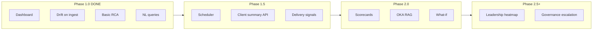
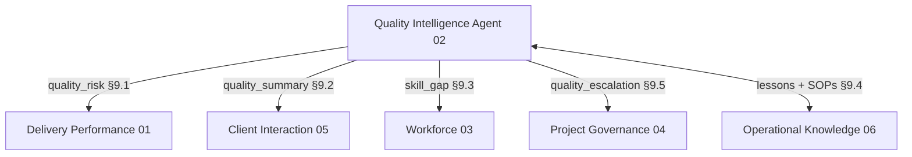

# Quality Intelligence Agent — Implementation Roadmap

**Agent ID:** 02  
**Agent name:** Quality Intelligence Agent  
**Document version:** 1.0  
**Last updated:** 2026-06-23  
**Status:** Living roadmap  

**Related documents:**

- Full specification: [`docs/AI Agents/quality_intelligence_agent_v1_0.md`](../AI%20Agents/quality_intelligence_agent_v1_0.md)
- MVP gaps (code delta): [`backend/app/agents/QUALITY_INTELLIGENCE_V1_GAPS.md`](../../backend/app/agents/QUALITY_INTELLIGENCE_V1_GAPS.md)
- Product requirements: [`docs/02. Product Requirements.md`](../02.%20Product%20Requirements.md) §7
- Platform roadmap: [`docs/04. Roadmap.md`](../04.%20Roadmap.md) §4.4
- Agent BRD: [`docs/03. Agent BRDs.md`](../03.%20Agent%20BRDs.md) §3

---

## Table of Contents

1. [Executive Summary](#1-executive-summary)
2. [Current State (MVP Shipped)](#2-current-state-mvp-shipped)
3. [Roadmap Phases Overview](#3-roadmap-phases-overview)
4. [Phase 1.0 — MVP (Complete)](#4-phase-10--mvp-complete)
5. [Phase 1.5 — Connected Agent](#5-phase-15--connected-agent)
6. [Phase 2.0 — Full Reasoning](#6-phase-20--full-reasoning)
7. [Phase 2.5 — Portfolio & Governance](#7-phase-25--portfolio--governance)
8. [Critical Path & Dependencies](#8-critical-path--dependencies)
9. [Use Case Tracker](#9-use-case-tracker)
10. [Business Rules Tracker](#10-business-rules-tracker)
11. [Data Model Evolution](#11-data-model-evolution)
12. [Inter-Agent Integration Plan](#12-inter-agent-integration-plan)
13. [Testing & Acceptance Gates](#13-testing--acceptance-gates)
14. [Open Decisions](#14-open-decisions)
15. [Risk Register](#15-risk-register)

---

## 1. Executive Summary

The Quality Intelligence Agent monitors annotation quality signals, detects drift before client impact, performs root-cause reasoning, and surfaces actionable recommendations. It operates in **passive (push)** and **active (pull)** modes.

**Where we are:** Phase 1.0 MVP is implemented — dashboard, drift-on-ingest, basic root-cause, NL queries, risk alerts, and DM notifications.

**Where we are going:** Full v1.0 spec coverage across seven use cases, six inter-agent integrations, granular QA data, Operational Knowledge Agent coupling, and portfolio-level reporting.



---

## 2. Current State (MVP Shipped)

### 2.1 Implemented capabilities

| Area | Implementation | Key paths |
|------|----------------|-----------|
| Weekly quality snapshots | `quality_snapshots`, `quality_error_entries` | `backend/app/api/routes/quality.py` |
| Drift detection | WoW delta, floor breach, 3-week trend, sample-size gate | `backend/app/agents/quality_intelligence/drift.py` |
| Root-cause (rule-based) | Onboarding gap + SOP ambiguity proxies | `backend/app/agents/quality_intelligence/root_cause.py` |
| Risk alerts & notifications | `quality_drift` alerts, DM notifications | `backend/app/agents/quality_intelligence/alerts.py` |
| Runtime thresholds | `metric_configurations.threshold_config` JSONB | `backend/app/services/quality_thresholds.py` |
| Quality dashboard API | Aggregated KPIs, trend, scorecard, alerts | `GET /projects/{id}/quality-dashboard` |
| Operations Tower UI | Live `/quality` page, no mocks | `frontend/src/routes/quality.tsx` |
| NL queries | 1 LLM call per question, evidence-grounded | `backend/app/agents/quality_intelligence/query_handler.py` |
| LLM integration | OpenAI-compatible `LLMClient` | `backend/app/services/llm/client.py` |
| Role scoping | Client persona filtering | `backend/app/services/quality_scoping.py` |
| Schema extensions | `evaluated_item_count`, `root_cause`, `confidence_level` | `supabase/migrations/20260624100000_quality_agent_mvp.sql` |

### 2.2 Spec build order status (§16.2)

| Step | Description | Status |
|------|-------------|--------|
| 1 | Dashboard metrics display | **Done** |
| 2 | Automated drift alert logic | **Done** (on ingest; not scheduled) |
| 3 | Root-cause reasoning (onboarding + SOP first) | **Partial** |
| 4 | Conversational query interface | **Done** |
| 5 | Inter-agent signal emission | **Not started** |
| 6 | Client narrative generation | **Not started** |
| 7 | What-if scenario analysis | **Not started** |
| 8 | Lesson log write-back to Knowledge Agent | **Not started** |

### 2.3 Product requirements status (QI-F01–F07)

| ID | Requirement | Status |
|----|-------------|--------|
| QI-F01 | Weekly snapshots per project/team | **Done** |
| QI-F02 | Drift flags on threshold breach | **Done** |
| QI-F03 | Error taxonomy entries with recommended action | **Done** |
| QI-F04 | Min categories (boundary, class confusion, guideline ambiguity) | **Partial** — free-text, no enum |
| QI-F05 | `quality_drift` risk alerts | **Done** |
| QI-F06 | Client-visible metrics via `metric_configurations` | **Partial** |
| QI-F07 | Weekly per-team granularity | **Done** |

---

## 3. Roadmap Phases Overview

| Phase | Platform alignment | Duration (estimate) | Goal |
|-------|-------------------|---------------------|------|
| **1.0 MVP** | `04. Roadmap.md` Phase 1 | Weeks 1–12 | Operable quality tower for pilot |
| **1.5 Connected** | End of Phase 1 / early pilot | Weeks 12–16 | Scheduler, client summary, delivery linkage |
| **2.0 Full reasoning** | `04. Roadmap.md` Phase 2 | Months 3–6 | Reviewer-level RCA, OKA, what-if, UC-03–05 |
| **2.5 Portfolio** | Phase 2+ | Months 6+ | Leadership heatmap, governance, per-org thresholds |

---

## 4. Phase 1.0 — MVP (Complete)

**Objective:** Ship spec §16.2 items 1–4 and product QI-F01–F07 for at least one pilot client.

### Deliverables (shipped)

- [x] `GET /projects/{project_id}/quality-dashboard`
- [x] `POST/PATCH /quality-snapshots` with drift evaluation on write
- [x] `POST /quality-snapshots/{id}/error-entries`
- [x] `POST /agent-queries` with `quality_intelligence_agent`
- [x] `GET /agent-queries/{query_id}`
- [x] Frontend quality dashboard + `AgentQueryBox`
- [x] Unit tests for drift, root-cause, scoping
- [x] `QUALITY_INTELLIGENCE_V1_GAPS.md` in backend

### Exit criteria (met for code-complete MVP)

- DM can POST weekly snapshot → drift evaluated → `risk_alert` + notification if breached
- `/quality` shows live KPIs without mock data
- Authorized user can ask NL quality questions with evidence links
- Root-cause JSON on drift snapshots when `evaluated_item_count ≥ 30`
- Client role cannot see reviewer identities

### Remaining MVP pilot tasks (operational, not code)

- [ ] Run migration `20260624100000_quality_agent_mvp.sql` on staging/prod
- [ ] Seed `metric_configurations` threshold JSON
- [ ] Configure `LLM_API_KEY`, `LLM_BASE_URL`, `LLM_MODEL` in environment
- [ ] Connect pilot QA export → weekly snapshot ingestion
- [ ] DM + QA Lead sign-off on pilot data

---

## 5. Phase 1.5 — Connected Agent

**Objective:** Finish Phase 1 platform promises: automated scans, quality in client comms, delivery risk linkage. Implements spec §16.2 steps 5–6 (partial).

**Estimated effort:** 2–4 weeks  
**Depends on:** Job scheduler decision, Client Interaction Agent draft API

### 5.1 Platform plumbing

| Task | Priority | Owner | Notes |
|------|----------|-------|-------|
| Choose scheduler (APScheduler in FastAPI, external cron → HTTP, Supabase Edge Function) | P0 | Engineering | Document in `08. Backend Architecture.md` |
| Resolve batch vs real-time gold-set evaluation (spec §16.3) | P0 | Product + QA | Drives scan cadence |
| Resolve client quality SLA thresholds | P1 | Product + Client | Drives client-visible alerts |

### 5.2 Scheduled quality pipeline

| Task | Deliverable | Exit criteria |
|------|-------------|---------------|
| Weekly drift re-scan job | `quality_intelligence.scan_all_projects()` | Alerts fire without manual POST |
| Post-ingestion hook from QA export pipeline | `ingestion.py` extension | Snapshot + evaluate in one transaction |
| Data-gap dashboard indicator | UI badge when sample &lt; 30 | No false drift alerts |
| Idempotent alert creation | Harden `alerts.py` | One open alert per team/week/metric |

### 5.3 Error taxonomy formalization

| Task | Deliverable | Exit criteria |
|------|-------------|---------------|
| `error_category` enum or lookup table (ERR-01–ERR-07) | Migration + seed | QI-F04 fully met |
| Validation on snapshot ingest | Pydantic / DB constraint | Invalid categories rejected |
| Frontend taxonomy labels | Display map | Consistent naming in charts |

### 5.4 Inter-agent: Delivery Performance (Agent 01)

| Task | Deliverable | Spec |
|------|-------------|------|
| Emit `quality_risk` signal on drift/rework breach | Event payload or shared table write | §9.1 |
| Include rework volume estimate in payload | Derived from `rework_rate_pct` + throughput | §9.1 |
| Delivery dashboard surfaces linked quality drift | UI / API cross-ref | `04. Roadmap.md` |

**Payload shape (target):**

```json
{
  "signal_type": "quality_risk",
  "project_id": "[uuid]",
  "team": "[team_id]",
  "rework_volume_units": 0,
  "rework_time_estimate_days": 0,
  "severity": "low | medium | high | critical",
  "hold_recommended": false,
  "affected_batch_ids": []
}
```

### 5.5 Inter-agent: Client Interaction (Agent 05)

| Task | Deliverable | Spec |
|------|-------------|------|
| `generate_quality_summary(project_id, period)` service | §8.4 JSON response | §9.2 |
| Wire into Client Interaction weekly draft | Client comms pipeline | UC-06 partial |
| DM approval gate before client send | Existing HITL workflow | BR-07 |
| Sanitize: no reviewer IDs, SOP IDs, raw error counts | `quality_scoping.py` extension | BR-03 |

### 5.6 RBAC hardening

| Task | Deliverable | Spec |
|------|-------------|------|
| PM project assignment scoping | Filter dashboard + queries | §14.1 |
| QA Lead full reviewer detail in NL responses | Role-aware context | §14.1 |
| Leadership aggregate view (org-level KPIs) | API endpoint stub | UC-07 partial |

### 5.7 Testing gate (Phase 1.5)

| Test | Target | Spec |
|------|--------|------|
| Synthetic drift detection | ≥ 90% of injected scenarios | §16.4 |
| RBAC persona matrix | No cross-persona leakage | §16.4 |
| Scheduler integration test | Drift fires on cron without manual POST | — |

### Phase 1.5 exit criteria

- Pilot client receives automated weekly drift evaluation
- Quality summary appears in DM-approved client weekly draft
- Delivery dashboard shows `quality_drift` linkage
- Error taxonomy validated on ingest

---

## 6. Phase 2.0 — Full Reasoning

**Objective:** Complete v1.0 spec depth — reviewer-level diagnosis, SOP workflow, knowledge loop, what-if. Aligns with platform Phase 2 and Regulatory-Grade Quality Layer.

**Estimated effort:** 2–3 months  
**Depends on:** Operational Knowledge Agent (Agent 06), expanded data schema

### 6.1 Data foundation (schema migrations)

| Table | Purpose | Unlocks |
|-------|---------|---------|
| `reviewer_scorecards` | Per-reviewer accuracy, error breakdown, weekly | UC-03, 50-item gate |
| `gold_set_evaluation_logs` | Item-level scores, error categories | Accurate RCA, BR-10 |
| `iaa_measurement_records` | Krippendorff α per reviewer pair / task type | UC-04, §6.3 IAA minimums |
| `rework_logs` | Per-item rework reason, dates | Rework spike diagnosis, schedule impact |
| `onboarding_records` | Calibration status, onboarding date | Replace annotator proxy |
| `sop_version_history` | Version, effective date, change summary | SOP change hypothesis, UC-04 |
| `gold_set_metadata` | Version, item count, last updated | Gold-set version hypothesis, BR-10 |

### 6.2 Root-cause engine v2

Expand `root_cause.py` to evaluate all six hypotheses in spec §7.2 order:

| # | Hypothesis | Phase 2 work |
|---|------------|--------------|
| 1 | Onboarding gap | Reviewer-level error attribution from scorecards |
| 2 | SOP change | Correlate `sop_version_history` with accuracy timeline |
| 3 | Task complexity spike | Project charter / new task type log |
| 4 | Gold-set version change | Compare pre/post `gold_set_metadata` update |
| 5 | Workload / fatigue | Cross-ref `throughput_snapshots` + workforce allocation |
| 6 | Systemic SOP ambiguity | Full UC-04 detection + workflow |

### 6.3 Use cases

#### UC-03: Reviewer calibration trigger

| Step | Deliverable |
|------|-------------|
| Identify above-threshold reviewers per error category | Scorecard query + 50-item minimum |
| Distinguish training gap vs SOP gap | Team-wide vs isolated pattern |
| Generate calibration brief | Reviewer IDs, category, task type, content refs |
| QA Lead notification | `notifications` + Operations Tower UI |
| Flag batches pending re-review | Status field or hold table |
| Notify Workforce Agent | `skill_gap` signal (§9.3) |

#### UC-04: SOP ambiguity detection and update trigger

| Step | Deliverable |
|------|-------------|
| Detect distributed IAA drop (3+ reviewers) | `iaa_measurement_records` |
| Correlate with SOP version change | `sop_version_history` |
| Generate SOP ambiguity flag | Task type, divergent decision, confidence |
| Route to QA Lead for human authorship | Notification + draft amendment text |
| Audit trail: quality event → SOP update | Link tables |

#### UC-05: What-if scenario analysis

| Step | Deliverable |
|------|-------------|
| Parse decision variable from NL query | Intent classifier extension |
| Retrieve historical recovery patterns | OKA lesson index |
| Model projected outcome with assumptions | Rule + LLM hybrid |
| Compare to recommended approach | Structured response template |
| Handle no-precedent case explicitly | Spec §13 edge case |

#### UC-02: Complete diagnostic queries

| Query type | Phase 2 work |
|------------|--------------|
| Impact (schedule, rework volume) | Cross-ref delivery milestones + rework logs |
| Historical (“how was W3 resolved?”) | OKA lesson retrieval |
| Report / client narrative on demand | §8.4 generator |

### 6.4 Operational Knowledge Agent integration (§9.4)

| Direction | Work |
|-----------|------|
| **Read** | RAG over SOPs, calibration decks, lessons by task type / error category / team tags |
| **Write** | §8.5 lesson log on resolved quality events (BR-08) |
| **Fallback** | Graceful degradation when OKA unavailable (spec §13) |

### 6.5 Inter-agent: Workforce (Agent 03)

Emit `skill_gap` payload on confirmed onboarding gap:

```json
{
  "signal_type": "skill_gap",
  "reviewer_ids": ["[uuid]"],
  "project_id": "[uuid]",
  "task_type": "[type]",
  "error_category": "[category]",
  "recommendation": "calibration | upskilling | reassignment",
  "urgency": "immediate | this_week | planned"
}
```

### 6.6 NL / LLM maturity

| Task | Notes |
|------|-------|
| LLM intent routing (optional) | Beyond keyword classifier |
| Structured output parsing | JSON mode for §8.3 / §8.4 |
| Citation enforcement | Post-process validate evidence IDs |
| Load test: 20 concurrent NL sessions | Spec §16.4 |
| QA Lead blind review of 20 recommendations | Spec §16.4, target &gt; 80% accuracy |

### Phase 2.0 exit criteria

- UC-03, UC-04, UC-05 operational with real scorecard data
- OKA enriches root-cause recommendations with lesson IDs and SOP refs
- Resolved quality events auto-generate lesson log entries
- What-if queries return projections with stated assumptions
- Workforce Agent receives `skill_gap` signals

---

## 7. Phase 2.5 — Portfolio & Governance

**Objective:** Leadership visibility, governance escalation, enterprise configurability.

**Estimated effort:** 1–2 months after Phase 2.0

### 7.1 UC-07: Cross-project quality trend reporting

| Deliverable | Spec |
|-------------|------|
| Portfolio aggregation API | Gold-set accuracy, IAA, rework across active projects |
| Vertical / task-type risk concentration | Heatmap data model |
| Leadership narrative summary | `bsg_leadership` role |
| Frontend `/leadership` quality section | Heatmap + brief |

### 7.2 Governance integration (Agent 04)

| Deliverable | Spec |
|-------------|------|
| Auto-escalation when drift unresolved &gt; 5 business days | BR-06, §9.5 |
| Critical severity immediate escalation | §12 |
| `quality_escalation` payload to Governance register | §9.5 |

### 7.3 Threshold configurability

| Deliverable | Spec |
|-------------|------|
| Per-client / per-project / per-task-type overrides | §12, DQ-032 |
| Admin UI for threshold management | Super Admin or DM |
| Audit log for threshold changes | Governance |

### 7.4 Dashboard & alert UX completion

| Deliverable | Spec |
|-------------|------|
| Per-team trend filter on chart | §8.1 |
| Rework rate vs target indicator on KPI cards | §8.1 |
| Drift alert actions: View analysis / Approve / Escalate | §8.2 |
| Schedule impact on alerts (days, units) | §8.2, QIA-US-05 |

### 7.5 Regulatory-Grade Quality Layer

Per `04. Roadmap.md` Phase 2 — cross-cutting, not agent-only:

- Dataset versioning
- Post-deployment monitoring
- Formal scorecard governance
- Annotator-level daily tracking (if DQ-026 / DQ-033 resolved)

### Phase 2.5 exit criteria

- Leadership has portfolio quality heatmap
- Unresolved drift auto-escalates to Governance
- Thresholds configurable per client without code deploy
- Full v1.0 business rules BR-01–BR-10 met

---

## 8. Critical Path & Dependencies

### 8.1 Sequential critical path

```
1. Scheduler + pilot QA ingestion
2. Error taxonomy enum + validation
3. §8.4 quality summary API → Client Interaction Agent
4. Delivery Agent quality_risk signal
5. onboarding_records + reviewer_scorecards tables
6. sop_version_history + UC-04 workflow
7. Operational Knowledge Agent (read path)
8. Lesson write-back (BR-08)
9. What-if engine (UC-05)
10. Governance auto-escalation (BR-06)
11. Leadership portfolio API (UC-07)
12. Per-org threshold overrides (DQ-032)
```

### 8.2 Parallel workstreams

| Stream | Can run alongside |
|--------|-------------------|
| Frontend (team filter, alert actions, leadership page) | Phase 1.5+ |
| Synthetic drift test suite | Phase 1.5 |
| RBAC persona test matrix | Phase 1.5 |
| OKA document ingestion (unstructured RAG) | Phase 2.0 |

### 8.3 External dependencies

| Dependency | Required for | Blocking phase |
|------------|--------------|----------------|
| Job scheduler / cron | UC-01 passive mode as designed | 1.5 |
| QA tooling export format | Real pilot data | 1.0 pilot sign-off |
| Client Interaction Agent draft API | UC-06 | 1.5 |
| Delivery Performance Agent signal consumer | §9.1 | 1.5 |
| Operational Knowledge Agent | Lessons, SOP RAG, what-if | 2.0 |
| Workforce Agent | Calibration scheduling | 2.0 |
| Governance Agent | BR-06 | 2.5 |
| Product decision on DQ-032 (global vs per-org thresholds) | §12 configurability | 2.5 |

---

## 9. Use Case Tracker

| UC | Name | MVP | 1.5 | 2.0 | 2.5 |
|----|------|-----|-----|-----|-----|
| UC-01 | Automated drift detection | Partial | Full | Full | Full |
| UC-02 | Root-cause on query | Partial | Partial | Full | Full |
| UC-03 | Reviewer calibration trigger | — | — | Full | Full |
| UC-04 | SOP ambiguity workflow | — | — | Full | Full |
| UC-05 | What-if analysis | — | — | Full | Full |
| UC-06 | Client quality narrative | — | Partial | Full | Full |
| UC-07 | Cross-project leadership report | — | Stub | Partial | Full |

---

## 10. Business Rules Tracker

| Rule | Description | MVP | Target phase |
|------|-------------|-----|--------------|
| BR-01 | Drift alert includes root-cause | Yes (n≥30) | 1.0 |
| BR-02 | Conclusions cite data sources | Yes | 1.0 |
| BR-03 | No reviewer IDs to clients | Yes | 1.0 |
| BR-04 | Confidence on every diagnostic | Yes | 1.0 |
| BR-05 | Sample size gate | Yes | 1.0 |
| BR-06 | 5-day auto-escalation to Governance | No | 2.5 |
| BR-07 | DM approval for client narratives | No | 1.5 |
| BR-08 | Lesson log on resolution | No | 2.0 |
| BR-09 | No direct SOP modification | Yes | 1.0 |
| BR-10 | Gold-set version tracking | No | 2.0 |

---

## 11. Data Model Evolution

### Phase 1.0 (existing)

- `quality_snapshots` — weekly team metrics + drift flags + `root_cause` JSONB
- `quality_error_entries` — taxonomy line items
- `metric_configurations.threshold_config` — runtime thresholds
- `risk_alerts`, `notifications` — alert delivery
- `agent_queries`, `agent_query_evidence_links` — NL audit trail

### Phase 1.5 (add)

- `error_categories` lookup table (or enum)
- Optional: `quality_scan_runs` audit log for scheduler

### Phase 2.0 (add)

- `reviewer_scorecards`
- `gold_set_evaluation_logs`
- `iaa_measurement_records`
- `rework_logs`
- `onboarding_records`
- `sop_version_history`
- `gold_set_metadata`
- `quality_lesson_links` (quality event ↔ OKA lesson)

### Phase 2.5 (add)

- `quality_threshold_overrides` (per org / project / task_type)
- `quality_escalations` (governance register linkage)

---

## 12. Inter-Agent Integration Plan



| Phase | Integration | Status |
|-------|-------------|--------|
| 1.0 | Local `risk_alerts` + `notifications` only | **Done** |
| 1.5 | → Delivery (`quality_risk`) | Planned |
| 1.5 | → Client Interaction (§8.4 summary) | Planned |
| 2.0 | → Workforce (`skill_gap`) | Planned |
| 2.0 | ↔ OKA (read lessons/SOPs, write lessons) | Planned |
| 2.5 | → Governance (`quality_escalation`) | Planned |

---

## 13. Testing & Acceptance Gates

### Per-phase gates

| Phase | Tests required | Acceptance |
|-------|----------------|------------|
| 1.0 | Unit: drift, RCA, scoping; API auth smoke | Code-complete MVP |
| 1.5 | Synthetic drift ≥ 90%; RBAC matrix; scheduler integration | Pilot sign-off |
| 2.0 | Scorecard RCA validation; OKA retrieval; what-if scenarios; 20 concurrent NL | QA Lead review &gt; 80% recommendation accuracy |
| 2.5 | Escalation timing; leadership aggregate; threshold override | BSG Leadership demo |

### Spec §16.4 full checklist (production)

- [ ] 90% synthetic drift detection
- [ ] RBAC test all personas — no leakage
- [ ] 10+ historical events validated against known root causes
- [ ] Load test 20 concurrent NL sessions
- [ ] QA Lead blind review of 20 recommendations

### Success metrics (spec §15 — track post-launch)

| Metric | Target |
|--------|--------|
| Rework rate across active projects | &lt; 4% sustained |
| Drift detection lead time | Alert before client impact 90% |
| Drift resolution time | &lt; 5 business days average |
| False positive alert rate | &lt; 10% |
| Root-cause diagnosis accuracy (QA confirmed) | &gt; 80% |
| NL response latency (standard) | &lt; 3s |
| NL response latency (root-cause) | &lt; 10s |
| Recommendation adoption rate | &gt; 70% |
| Lesson log capture rate | 100% of resolved events |

---

## 14. Open Decisions

Resolve before or during indicated phase. Full list in spec §16.3 and `16. Decisions & Open Questions.md`.

| ID | Question | Impact | Resolve by |
|----|----------|--------|------------|
| — | Batch vs continuous gold-set evaluation | Scheduler design | Phase 1.5 start |
| — | Gold-set ownership and approval process | BR-10 implementation | Phase 2.0 |
| DQ-032 | `metric_configurations` global vs per-org | Threshold schema | Phase 2.5 |
| — | Client quality SLA definition | Client-visible alert thresholds | Phase 1.5 |
| DQ-026 / DQ-033 | Annotator-level daily tracking in scope? | Regulatory layer depth | Phase 2.5 |

---

## 15. Risk Register

| Risk | Likelihood | Impact | Mitigation |
|------|------------|--------|------------|
| No real QA export for pilot | Medium | High | Manual snapshot POST; prioritize ingestion adapter in 1.5 |
| OKA not ready for Phase 2.0 | Medium | High | Rule-based RCA + explicit “no lessons available” in responses |
| LLM hallucination on RCA | Medium | High | `require_evidence()`, pre-computed analysis in prompt, confidence gates |
| Scheduler not chosen | Low | Medium | Default: post-ingestion hook + daily HTTP cron to `/internal/quality-scan` |
| Threshold changes without governance | Low | Medium | Audit log + Super Admin only until DQ-032 resolved |
| Reviewer PII in client responses | Low | Critical | `quality_scoping` filters + automated RBAC tests |

---

## Appendix A — LLM usage by phase

| Action | LLM calls | Phase |
|--------|-----------|-------|
| Load quality dashboard | 0 | 1.0 |
| POST quality snapshot / drift | 0 | 1.0 |
| NL query in Agent box | 1 per question | 1.0 |
| Client weekly summary draft | 1 per draft (via Client Agent) | 1.5 |
| What-if projection narrative | 1 per query | 2.0 |

Context sent per NL query: up to 6 `quality_snapshots` + error entries + 5 open drift alerts + pre-computed drift/RCA JSON. See `query_handler.py` and `prompts.py`.

---

## Appendix B — Key API surface (current + planned)

| Method | Path | Phase |
|--------|------|-------|
| GET | `/projects/{id}/quality-dashboard` | 1.0 ✅ |
| GET/POST | `/projects/{id}/quality-snapshots` | 1.0 ✅ |
| PATCH | `/quality-snapshots/{id}` | 1.0 ✅ |
| POST | `/quality-snapshots/{id}/error-entries` | 1.0 ✅ |
| POST | `/agent-queries` (`quality_intelligence_agent`) | 1.0 ✅ |
| GET | `/agent-queries/{id}` | 1.0 ✅ |
| GET | `/projects/{id}/quality-summary?period=W{n}` | 1.5 |
| POST | `/internal/quality-scan` (cron trigger) | 1.5 |
| GET | `/leadership/quality-portfolio` | 2.5 |

---

*This roadmap should be updated when phases complete or when open decisions are resolved. Mirror substantive changes in `QUALITY_INTELLIGENCE_V1_GAPS.md` and `04. Roadmap.md`.*
