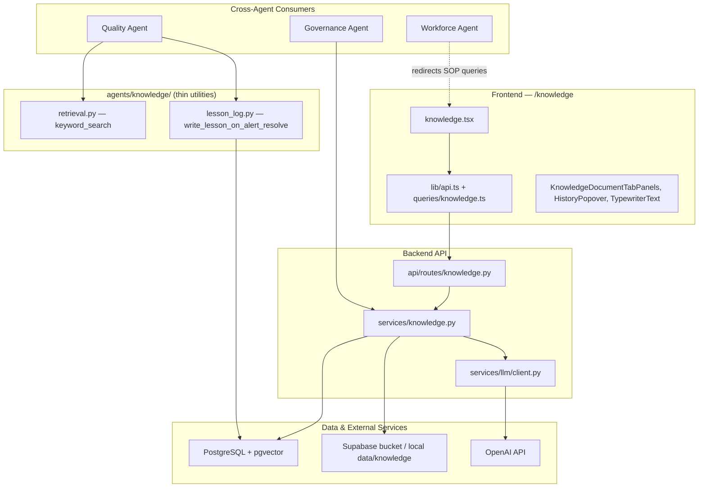
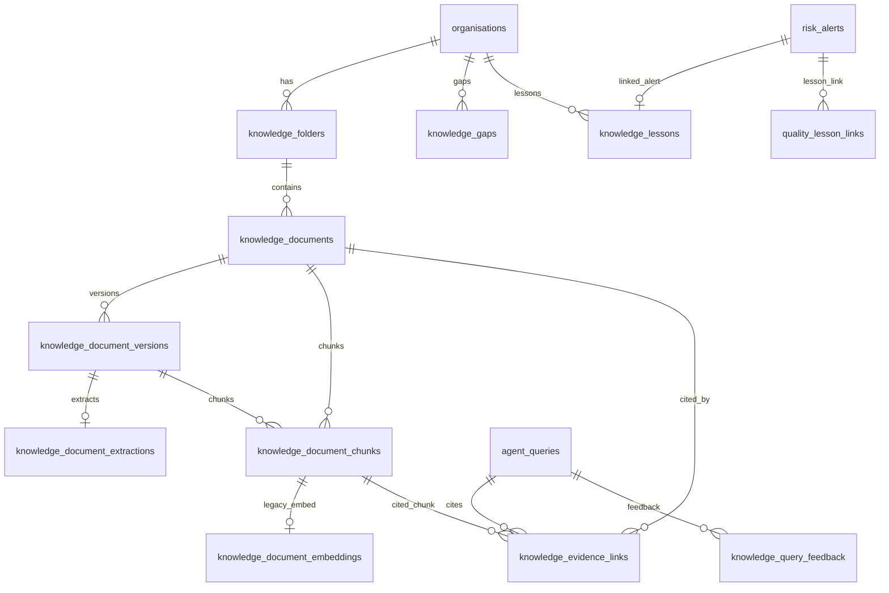
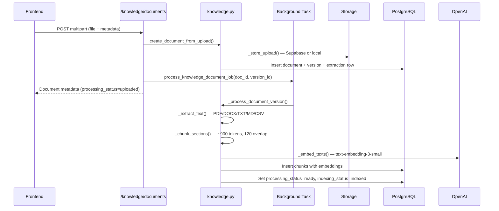
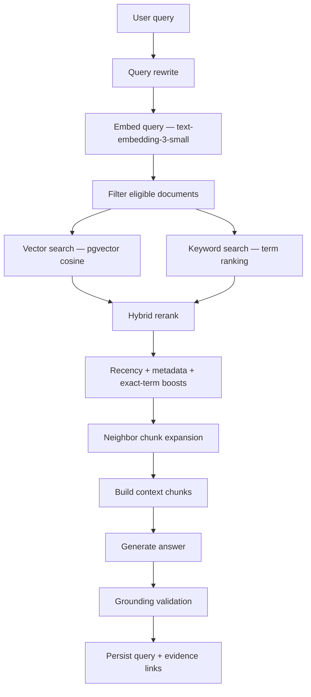
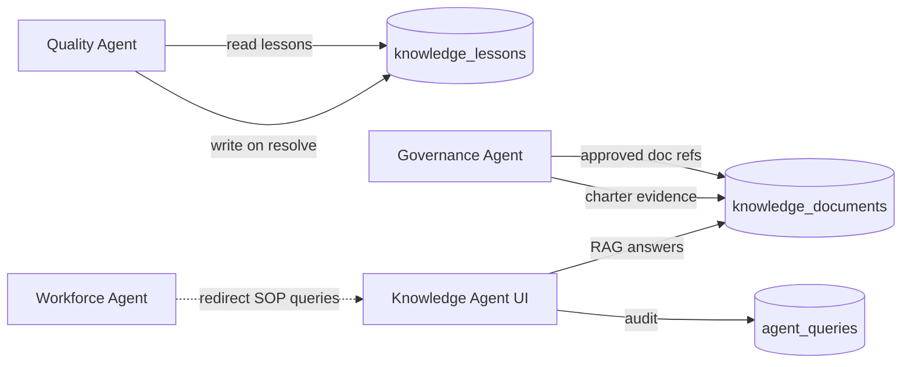

# Operational Knowledge Agent — Detailed Audit

> **Audit date:** 09-07-2026  
> **Scope:** Full codebase review of the Operational Knowledge Agent (OKA)  
> **Canonical identifiers:** `operational_knowledge_agent` (DB), `/knowledge` (API/UI)  
> **Note:** There is no agent spelled `"knowle"` in this repository. The product name is **Operational Knowledge Agent**; internal shorthand is sometimes **OKA**.

---

## Table of Contents

1. [Executive Summary](#1-executive-summary)
2. [Agent Identity & Product Positioning](#2-agent-identity--product-positioning)
3. [Architecture Overview](#3-architecture-overview)
4. [Implementation Map](#4-implementation-map)
5. [Data Model](#5-data-model)
6. [Document Ingestion Pipeline](#6-document-ingestion-pipeline)
7. [RAG & Retrieval Pipeline](#7-rag--retrieval-pipeline)
8. [Q&A Orchestration](#8-qa-orchestration)
9. [LLM Integration & Prompts](#9-llm-integration--prompts)
10. [Security, RBAC & Governance](#10-security-rbac--governance)
11. [API Surface](#11-api-surface)
12. [Frontend Application](#12-frontend-application)
13. [Cross-Agent Integrations](#13-cross-agent-integrations)
14. [Configuration & Environment](#14-configuration--environment)
15. [Database Migrations Timeline](#15-database-migrations-timeline)
16. [Test Coverage](#16-test-coverage)
17. [Spec vs Implementation](#17-spec-vs-implementation)
18. [Gaps, Risks & Technical Debt](#18-gaps-risks--technical-debt)
19. [Recommendations](#19-recommendations)
20. [Appendix: Key Constants & Thresholds](#20-appendix-key-constants--thresholds)

---

## 1. Executive Summary

The **Operational Knowledge Agent** is a substantially implemented Phase 2+ agent that turns BSG's operational process knowledge (SOPs, guides, charters, escalation notes, lessons learned) into a governed document library with hybrid RAG-powered Q&A.

| Dimension | Assessment |
|-----------|------------|
| **Implementation status** | Production-grade core: upload, ingest, index, retrieve, answer, cite, audit |
| **Primary backend** | `backend/app/services/knowledge.py` (~4,300 lines) |
| **Primary frontend** | `frontend/src/routes/knowledge.tsx` (~2,900 lines) at `/knowledge` |
| **Agent name in DB** | `operational_knowledge_agent` |
| **Vector store** | PostgreSQL + pgvector (HNSW index on chunk embeddings) |
| **LLM provider** | OpenAI (`text-embedding-3-small` + `gpt-4o-mini` / `gpt-4o`) |
| **Cross-agent hooks** | Quality (lesson write-back/read), Governance (approved doc refs), Workforce (SOP redirect) |
| **MVP compliance** | Spec says Phase 2+ hidden from MVP; UI is **live** at `/knowledge` |

The agent is **not** routed through the generic `POST /agent-queries` endpoint. All Q&A goes through dedicated `/knowledge/ask` and `/knowledge/ask/stream` routes.

---

## 2. Agent Identity & Product Positioning

### 2.1 What the agent does

Per `docs/AI Agents/06. Operational Knowledge Agent.md`, the agent's mandate is to:

- Retrieve relevant SOPs and process documents
- Provide step-by-step operational guidance
- Reference historical issues and lessons learned
- Recommend best practices grounded in approved sources
- Deliver context-aware assistance tied to project, role, and evidence

### 2.2 What the agent does **not** own

| Domain | Owner agent |
|--------|-------------|
| Quality metrics, drift detection, error taxonomy | Quality Intelligence Agent |
| Milestone risk, throughput, delivery confidence | Delivery Performance Agent |
| Client-facing narratives and communications | Client Interaction Agent |
| Workforce utilization, skills, training gaps | Workforce & Capability Agent |
| Project governance workflows, charters, escalations | Project Governance Agent |

The Workforce Agent explicitly **redirects** SOP/document/policy questions to OKA rather than answering them itself.

### 2.3 Phase placement

| Source | Stated phase |
|--------|--------------|
| Agent spec (`06. Operational Knowledge Agent.md`) | Phase 2+ |
| `docs/11. AI & RAG Architecture.md` | Phase 2 agent |
| `docs/04. Roadmap.md` | Phase 2 expansion |
| **Current implementation** | Fully exposed in Operations Tower nav as "Knowledge Agent" → `/knowledge` |

This is a **spec vs implementation divergence**: documentation says MVP must not expose OKA in UI, but the frontend Shell includes a live nav item.

### 2.4 Personas & roles

| Persona | Access today |
|---------|--------------|
| Delivery Manager | Full access (upload, ask, manage docs) |
| BSG Leadership | Full access + retrieval settings admin |
| Super Admin | Full access + retrieval settings admin |
| Client User | **Not supported** on `/knowledge` routes (no `CLIENT` role in route guards) |
| QA Lead / PM / Ops Manager | Covered by `DELIVERY_MANAGER` role in current RBAC |

---

## 3. Architecture Overview

### 3.1 High-level system diagram



### 3.2 Architectural decisions

1. **Monolithic service layer** — Nearly all business logic lives in `services/knowledge.py`. The `agents/knowledge/` package is a thin utility layer for cross-agent imports (`keyword_search`, `write_lesson_on_alert_resolve`).

2. **Dedicated API surface** — OKA does not register in the generic agent query router. Q&A, document management, and settings all live under `/knowledge/*`.

3. **Hybrid RAG** — Vector search (pgvector cosine distance) combined with keyword/term scoring, hybrid reranking with recency and metadata boosts, neighbor chunk expansion, and post-generation grounding validation.

4. **Background ingestion** — Upload triggers `process_knowledge_document_job` via FastAPI `BackgroundTasks` (extract → chunk → embed → mark ready).

5. **Audit trail** — Every answer creates an `agent_queries` row with `agent_name='operational_knowledge_agent'` plus `knowledge_evidence_links` for cited chunks.

6. **Multi-turn conversations** — Grouped via `agent_queries.conversation_id` (self-referential FK to the first query in a thread).

7. **Optional external OKA HTTP service** — `OKAClient` in Quality Agent can call `{OKA_BASE_URL}/lessons/*` when configured; primary store is in-database.

---

## 4. Implementation Map

### 4.1 Backend — core

| File | Lines (approx) | Purpose |
|------|----------------|---------|
| `backend/app/services/knowledge.py` | ~4,300 | **Primary implementation**: library CRUD, ingestion, hybrid RAG, Q&A (sync + stream), gaps, feedback, conversations, bootstrap, retrieval settings |
| `backend/app/api/routes/knowledge.py` | ~500 | FastAPI router for all `/knowledge/*` endpoints |
| `backend/app/services/llm/client.py` | — | RAG system prompts, `generate_rag_answer`, `stream_rag_answer`, prompt-injection hardening |
| `backend/app/schemas/domain.py` | — | Pydantic schemas: `KnowledgeAskCreate`, `KnowledgeDocumentRead`, bootstrap, gaps, retrieval settings |
| `backend/app/db/models/entities.py` | — | SQLAlchemy models for all knowledge tables and enums |
| `backend/app/core/config.py` | — | `oka_base_url`, embedding model, storage bucket, upload dir |
| `backend/app/core/constants.py` | — | `SUPPORTED_KNOWLEDGE_EXTENSIONS`: `.pdf`, `.docx`, `.txt`, `.md`, `.csv` |
| `backend/app/main.py` | — | Registers `knowledge.router` at API prefix |

### 4.2 Backend — cross-agent utilities

| File | Purpose |
|------|---------|
| `backend/app/agents/knowledge/__init__.py` | Exports `keyword_search`, `write_lesson_on_alert_resolve` |
| `backend/app/agents/knowledge/retrieval.py` | ILIKE keyword search over `knowledge_lessons` (used by Quality Agent) |
| `backend/app/agents/knowledge/lesson_log.py` | Creates `KnowledgeLesson` + `QualityLessonLink` on quality alert resolve (BR-08) |
| `backend/app/agents/governance/services/knowledge_link_service.py` | Read-only list of approved governance-related knowledge docs |
| `backend/app/agents/governance/services/charter_service.py` | Charter generation pulls approved knowledge docs as evidence |
| `backend/app/agents/governance/query_handler.py` | Governance Q&A collects knowledge items as evidence |
| `backend/app/agents/quality_intelligence/oka_client.py` | Optional HTTP client for external OKA service |
| `backend/app/agents/quality_intelligence/query_handler.py` | Quality Q&A: OKA lesson retrieval + `keyword_search` fallback |
| `backend/app/agents/quality_intelligence/what_if.py` | What-if analysis uses `keyword_search` for lessons |
| `backend/app/services/quality.py` | Alert resolve calls `write_lesson_on_alert_resolve` |
| `backend/app/services/workforce_agent.py` | Redirects SOP/document questions to OKA |

### 4.3 Frontend

| File | Purpose |
|------|---------|
| `frontend/src/routes/knowledge.tsx` | Main Knowledge Agent page: library, upload, ask panel, streaming chat, gaps, settings |
| `frontend/src/types/knowledge.ts` | TypeScript API types |
| `frontend/src/lib/api.ts` | API client functions for all `/knowledge/*` endpoints |
| `frontend/src/lib/queries/knowledge.ts` | TanStack Query hooks, cache invalidation |
| `frontend/src/lib/knowledge-mappers.ts` | API ↔ UI model mapping, `isRetrievalReady()` |
| `frontend/src/lib/queries/keys.ts` | Query keys: `knowledgeBootstrap`, `knowledgeAgentQueries`, etc. |
| `frontend/src/components/knowledge/knowledge-ui.tsx` | Shared UI primitives (badges, meta rows, quality score) |
| `frontend/src/components/knowledge/KnowledgeDocumentTabPanels.tsx` | Document detail tabs; retrieval eligibility messaging |
| `frontend/src/components/knowledge/KnowledgeHistoryPopover.tsx` | Saved conversation history popover |
| `frontend/src/components/knowledge/TypewriterText.tsx` | Streaming answer typewriter effect |
| `frontend/src/components/knowledge/TypingIndicator.tsx` | Loading indicator (reused in delivery chat) |
| `frontend/src/components/bsg/Shell.tsx` | Nav item: **Knowledge Agent** → `/knowledge` |
| `frontend/src/hooks/useDocumentTabLoader.ts` | Lazy-loads document tab data from knowledge API |

### 4.4 Documentation

| File | Purpose |
|------|---------|
| `docs/AI Agents/06. Operational Knowledge Agent.md` | Primary agent specification |
| `docs/11. AI & RAG Architecture.md` | RAG platform context |
| `docs/03. Agent BRDs.md` | Agent 6 BRD summary |
| `docs/09. API Specification.md` | Lists `operational_knowledge_agent` as supported agent name |
| `docs/AI Agents/04. Project Governance.md` | Governance ↔ Knowledge integration |
| `docs/AI Agents/quality_intelligence_agent_v1_0.md` | Quality ↔ Knowledge read/write contract |

---

## 5. Data Model

### 5.1 Entity-relationship overview



### 5.2 Core tables

| Table | Model class | Purpose |
|-------|-------------|---------|
| `knowledge_folders` | `KnowledgeFolder` | Org folders: `sops`, `guides`, `histories`, `custom` |
| `knowledge_documents` | `KnowledgeDocument` | Document metadata, workflow state, processing/indexing status |
| `knowledge_document_versions` | `KnowledgeDocumentVersion` | Versioned uploads per document |
| `knowledge_document_extractions` | `KnowledgeDocumentExtraction` | Extraction job status and diagnostics per version |
| `knowledge_document_chunks` | `KnowledgeDocumentChunk` | Chunked text + `embedding vector(1536)` |
| `knowledge_document_embeddings` | `KnowledgeDocumentEmbedding` | Legacy/alternate embedding storage (JSONB) |
| `knowledge_evidence_links` | `KnowledgeEvidenceLink` | Citation links: query → document/chunk + relevance score |
| `knowledge_lessons` | `KnowledgeLesson` | Structured lesson log (quality write-back) |
| `knowledge_gaps` | `KnowledgeGap` | Unanswered queries surfaced as library todos |
| `knowledge_query_feedback` | `KnowledgeQueryFeedback` | User thumbs up/down per `agent_query_id` |
| `knowledge_retrieval_settings` | *(raw SQL)* | Org-level retrieval defaults |

### 5.3 Shared agent tables

| Table | OKA usage |
|-------|-----------|
| `agent_queries` | Every Q&A turn; `agent_name='operational_knowledge_agent'`, `retrieval_params` JSONB, `conversation_id` |
| `quality_lesson_links` | Links resolved alerts → `knowledge_lessons` |

### 5.4 Enums

**Folder kinds:** `sops`, `guides`, `histories`, `custom`

**Source types:** `sop`, `guide`, `training_document`, `project_charter`, `escalation_note`, `lesson_learned`

**Visibility:** `internal_only`, `leadership_only`, `client_safe`

**Document status:** `draft`, `approved`, `archived`

**Processing status:** `uploaded` → `extracting` → `extracted` → `chunking` → `chunked` → `embedding` → `ready` (or `failed`)

**Indexing status:** `not_indexed`, `indexing`, `indexed`, `failed`

**Feedback rating:** `up`, `down`

**Gap status:** `open`, `resolved`

### 5.5 Retrieval eligibility rules

A document is eligible for RAG retrieval when **all** of the following hold:

1. `deleted_at IS NULL`
2. `status = approved` (unless `only_approved=false` in retrieval settings)
3. `indexing_status = indexed`
4. `processing_status = ready`
5. User role passes `can_access_visibility(role, visibility)`
6. In `client_safe` answer mode: `visibility = client_safe` only

### 5.6 Visibility access matrix

| Role | `internal_only` | `leadership_only` | `client_safe` |
|------|-----------------|-------------------|---------------|
| `DELIVERY_MANAGER` | ✓ | ✗ | ✓ |
| `BSG_LEADERSHIP` | ✓ | ✓ | ✓ |
| `SUPER_ADMIN` | ✓ | ✓ | ✓ |
| `CLIENT` | ✗ | ✗ | ✓ (theory; no UI route today) |

---

## 6. Document Ingestion Pipeline

### 6.1 Upload flow



### 6.2 Supported file types

| Extension | Extractor |
|-----------|-----------|
| `.pdf` | PyPDF-based extraction with page sections |
| `.docx` | python-docx paragraph extraction |
| `.txt`, `.md` | Direct text with section detection |
| `.csv` | Row-based text conversion |

### 6.3 Chunking parameters

| Constant | Value | Meaning |
|----------|-------|---------|
| `CHUNK_TARGET_TOKENS` | 900 | Target chunk size |
| `CHUNK_OVERLAP_TOKENS` | 120 | Overlap between adjacent chunks |
| `EMBEDDING_BATCH_SIZE` | 64 | OpenAI embedding batch size |
| `EMBEDDING_INPUT_MAX_CHARS` | 2000 | Max chars sent per embedding call |

### 6.4 Extraction quality gates

The pipeline assesses extraction quality and can flag:

- Scanned PDFs with insufficient text (`EXTRACTION_MIN_CHARS = 200`)
- Low chars-per-page ratio (`EXTRACTION_MIN_CHARS_PER_PAGE = 80`)
- Too few chunks (`EXTRACTION_MIN_CHUNKS = 2`)

Upload metadata quality scoring (`_assess_upload_quality`) requires a minimum metadata score before auto-approving for indexing (`UPLOAD_APPROVED_MIN_METADATA_SCORE = 4` out of 6 criteria).

### 6.5 Storage

- **Primary:** Supabase Storage bucket `knowledge-documents` (configurable via `knowledge_storage_bucket`)
- **Fallback:** Local filesystem at `backend/data/knowledge/{org_id}/{document_id}/`

### 6.6 Reindexing

`POST /knowledge/documents/{id}/index` triggers the same `process_knowledge_document_job` background task. Requires explicit user action header (`X-BSG-User-Action: true`).

### 6.7 Version management

- Each upload creates a `knowledge_document_versions` row
- Only one version is `is_active` at a time
- Version compare endpoint diffs extracted text between two versions
- Chunks are tied to `version_id` for retrieval consistency

---

## 7. RAG & Retrieval Pipeline

### 7.1 Retrieval flow



### 7.2 Query rewrite

Multi-turn follow-up questions are rewritten for better retrieval:

- **Fast path:** Rule-based rewrite when query is self-contained or uses pronouns with clear history context
- **LLM path:** `_build_standalone_retrieval_query()` calls the LLM when follow-up pronouns (`it`, `that`, `this`) need disambiguation
- **Security:** `_neutralize_rewrite_context()` redacts prompt-injection patterns from history before rewrite

### 7.2 Hybrid scoring

| Component | Weight | Description |
|-----------|--------|-------------|
| Vector score | 0.68 (`HYBRID_VECTOR_WEIGHT`) | Cosine similarity from pgvector |
| Keyword score | 0.32 (`HYBRID_KEYWORD_WEIGHT`) | Term frequency ranking |
| Recency boost | up to 0.12 (`RECENCY_BOOST_MAX`) | Newer `effective_date` / `updated_at` |
| Exact term boost | up to 0.10 (`EXACT_TERM_BOOST_MAX`) | Quoted or capitalized terms |
| Metadata boost | up to 0.08 (`METADATA_BOOST_MAX`) | Project/department/source_type match |

### 7.3 Vector search SQL

Uses raw SQL with pgvector operator `<=>` (cosine distance):

```sql
SELECT c.id, ..., 1 - (c.embedding <=> CAST(:vec AS vector)) AS score
FROM knowledge_document_chunks c
WHERE c.document_id = ANY(:doc_ids)
  AND c.embedding IS NOT NULL
ORDER BY c.embedding <=> CAST(:vec AS vector)
LIMIT :top_k
```

Filtered to `active_version_id` chunks only.

### 7.4 Candidate limits

| Constant | Value |
|----------|-------|
| `RERANK_CANDIDATE_LIMIT` | 20 |
| `DEFAULT_MAX_SOURCES` | 3 |
| `TERM_FALLBACK_CHUNK_LIMIT` | 500 |
| `NEIGHBOR_CHUNK_WINDOW` | 1 (adjacent chunks included) |

### 7.5 Structured operational context

When the query mentions project-specific operational data, `_build_structured_operational_context()` enriches the LLM prompt with:

- Project name, status, target end date
- Recent milestones (up to 5)
- Latest throughput snapshot
- Latest quality snapshot (gold accuracy, IAA, rework, drift alert)
- Open risks and bottlenecks (summarized in client-safe mode)

This bridges the spec requirement to combine quality/delivery structured data with document RAG.

### 7.6 Answer caching

In-memory answer cache with:

- TTL: 300 seconds (`KNOWLEDGE_ANSWER_CACHE_TTL_S`)
- Keyed by org + query + scope fingerprint + retrieval params
- Invalidated on document changes via `_invalidate_knowledge_answer_cache()`

Embedding cache: separate 5-minute / 1000-entry LRU for query embeddings.

### 7.7 Grounding validation

`_ground_generation()` post-checks the LLM answer against retrieved chunks and structured context:

- Extracts claims from answer text
- Measures support ratio against source material
- Rejects answers with support < 0.2
- Downgrades confidence when grounding is weak

---

## 8. Q&A Orchestration

### 8.1 Non-streaming path (`ask_knowledge_agent`)

1. Validate `conversation_id` (ownership check)
2. Run `_retrieve_knowledge_context()`
3. Handle empty/filtered results → `_persist_empty_ask_response()` + optional gap recording
4. Build context chunks from matches
5. Optionally attach structured operational context
6. Call `LLMClient.generate_rag_answer()`
7. Run grounding validation
8. Compute confidence: `0.6 * llm_confidence + 0.4 * retrieval_signal`
9. Persist `AgentQuery` with `retrieval_params` debug payload
10. Persist `KnowledgeEvidenceLink` rows (one per cited chunk)
11. Return `KnowledgeAskRead`

### 8.2 Streaming path (`/knowledge/ask/stream`)

Two-phase SSE:

1. **`prepare_stream_knowledge_ask()`** — runs retrieval while DB session is open; may emit early SSE events (searching, reading phases)
2. **`stream_prepared_knowledge_ask()`** — streams LLM tokens via `LLMClient.stream_rag_answer()`; persists query on completion

Uses a separate `AsyncSessionLocal()` for preparation to avoid holding the request session during streaming.

### 8.3 Empty answer handling

When no approved answer can be generated:

- Returns canonical message: `"I could not find this information in the uploaded knowledge base."`
- May create a `knowledge_gaps` row for library health tracking
- Still persists an `agent_queries` row for audit

### 8.4 Confidence scoring

| Signal | Weight |
|--------|--------|
| LLM self-reported confidence | 60% |
| Top retrieval match score | 40% |

Confidence reasons are built from:

- Number and quality of matched documents
- SOP staleness warnings (`SOP_STALE_DAYS = 365`)
- Grounding support level
- Client-safe mode indicator
- Low confidence warning when score < `LOW_CONFIDENCE_THRESHOLD` (0.5)

### 8.5 Structured answer format

Internal mode returns JSON with:

```json
{
  "answer": "...",
  "next_step": "...",
  "confidence": 0.85,
  "structured": {
    "policy": "...",
    "steps": "...",
    "owner": "...",
    "evidence": "...",
    "next_action": "..."
  }
}
```

Fast path (top chunk score ≥ 0.85) skips structured fields for lower latency.

### 8.6 Conversations

- First query in a thread: `conversation_id` set to its own `id`
- Follow-up queries: pass `conversation_id` from first turn
- Only the owning user (or leadership/admin) can continue a conversation
- History endpoint: `GET /knowledge/conversations` and `GET /knowledge/conversations/{id}`

### 8.7 Feedback loop

`POST /knowledge/feedback` records thumbs up/down per query. Upserts on `(agent_query_id, user_id)`. Stored in `knowledge_query_feedback` with optional comment.

### 8.8 Knowledge gaps

When retrieval fails or confidence is low, the system can record `knowledge_gaps` entries surfaced in library health as todos. `POST /knowledge/gaps/{gap_id}/resolve` marks them resolved.

---

## 9. LLM Integration & Prompts

### 9.1 Models

| Use case | Model | Config key |
|----------|-------|------------|
| Embeddings | `text-embedding-3-small` (1536-d) | `knowledge_embedding_model` |
| RAG answers (default) | `gpt-4o-mini` | `openai_model` / `llm_model` |
| Strong answers (available) | `gpt-4o` | `knowledge_strong_model` |

### 9.2 System prompts (`backend/app/services/llm/client.py`)

| Prompt | When used |
|--------|-----------|
| `_SYSTEM_PROMPT` | Internal RAG — full structured JSON response |
| `_CLIENT_SAFE_PROMPT` | Client-safe mode — restricted wording and sources |
| `_FAST_SYSTEM_PROMPT` | Top chunk score ≥ 0.85 — skips structured fields |
| `_UNTRUSTED_DATA_RULES` | Injected into user message for all RAG calls |

### 9.3 Prompt security

Injection patterns detected and redacted:

- "ignore previous instructions"
- "disregard system prompt"
- "you are now" / "act as"
- "reveal prompt/secret/api key"
- "return only" override attempts

Redaction applied to:

- Document chunk content in user messages
- Conversation history (rendered as untrusted context, not chat roles)
- Query rewrite context

### 9.4 Token limits

| Constant | Value |
|----------|-------|
| `RAG_CONTEXT_CHUNK_CHARS` | 800 per chunk in prompt |
| `RAG_MAX_OUTPUT_TOKENS` | 700 |
| `FAST_PATH_MAX_TOKENS` | 400 |
| `FAST_PATH_THRESHOLD` | 0.85 top chunk score |

---

## 10. Security, RBAC & Governance

### 10.1 Authentication & authorization

All `/knowledge/*` endpoints require one of:

- `DELIVERY_MANAGER`
- `BSG_LEADERSHIP`
- `SUPER_ADMIN`

Retrieval settings PATCH restricted to `BSG_LEADERSHIP` and `SUPER_ADMIN`.

AI-cost endpoints require explicit user action:

- `POST /knowledge/ask` — `X-BSG-User-Action: true`
- `POST /knowledge/ask/stream` — same
- `POST /knowledge/documents/{id}/index` — same
- `GET /knowledge/documents?ai_rank=true` — same

### 10.2 Tenant isolation

- All queries filtered by `org_id` from authenticated user
- RLS context set via `set_rls_context()` on streaming prep session
- Folder uniqueness per org (seed kinds + unlimited custom folders)

### 10.3 Approved-source-only retrieval

Default `only_approved=true` in org retrieval settings. Draft documents excluded from RAG unless explicitly overridden.

### 10.4 Audit logging

Every Q&A creates:

- `agent_queries` row with full `retrieval_params` debug (timings, scores, filters, confidence)
- `knowledge_evidence_links` with per-chunk relevance scores
- `latency_ms` and `model_used` recorded

### 10.5 Soft delete

Documents and folders use `deleted_at` soft delete. Deleted documents excluded from retrieval.

---

## 11. API Surface

Base path: `/api/v1` (app prefix) + routes below.

### 11.1 Bootstrap & health

| Method | Path | Auth | User action | Purpose |
|--------|------|------|-------------|---------|
| `GET` | `/knowledge/bootstrap` | DM, Leadership, Admin | No | Folders, recent docs, counts, permissions, health |
| `GET` | `/knowledge/library-health` | DM, Leadership, Admin | No | Library health + open gaps |

### 11.2 Folders

| Method | Path | Purpose |
|--------|------|---------|
| `GET` | `/knowledge/folders` | List folders |
| `POST` | `/knowledge/folders` | Create custom folder |

### 11.3 Documents

| Method | Path | User action | Purpose |
|--------|------|-------------|---------|
| `GET` | `/knowledge/documents` | AI rank only | List/filter documents |
| `GET` | `/knowledge/documents/{id}` | No | Document detail + chunks |
| `GET` | `/knowledge/documents/{id}/download` | No | File download |
| `POST` | `/knowledge/documents` | No | Upload document (multipart) |
| `PATCH` | `/knowledge/documents/{id}` | No | Update metadata/status |
| `DELETE` | `/knowledge/documents/{id}` | No | Soft delete |
| `POST` | `/knowledge/documents/{id}/index` | Yes | Reindex document |
| `GET` | `/knowledge/documents/{id}/versions` | No | Version history |
| `GET` | `/knowledge/documents/{id}/versions/compare` | No | Diff two versions |

### 11.4 Q&A

| Method | Path | User action | Purpose |
|--------|------|-------------|---------|
| `POST` | `/knowledge/ask` | Yes | Ask Knowledge Agent (JSON) |
| `POST` | `/knowledge/ask/stream` | Yes | Streaming SSE answer |
| `GET` | `/knowledge/queries/{query_id}` | No | Fetch past answer |
| `GET` | `/knowledge/conversations` | No | List conversation summaries |
| `GET` | `/knowledge/conversations/{id}` | No | Full conversation with turns |

### 11.5 Feedback, gaps, settings

| Method | Path | Auth | Purpose |
|--------|------|------|---------|
| `POST` | `/knowledge/feedback` | DM+ | Submit query feedback |
| `POST` | `/knowledge/gaps/{gap_id}/resolve` | DM+ | Resolve knowledge gap |
| `GET` | `/knowledge/retrieval-settings` | DM+ | Org retrieval defaults |
| `PATCH` | `/knowledge/retrieval-settings` | Leadership, Admin | Update defaults |

### 11.6 Not routed through generic agent API

`POST /agent-queries` does **not** dispatch to OKA. The frontend uses dedicated `/knowledge/ask` endpoints. Historical queries can be listed via `GET /agent-queries` and filtered client-side.

---

## 12. Frontend Application

### 12.1 Page structure (`/knowledge`)

The Knowledge page is a full workspace with:

1. **Library panel** — folder tree, document list, filters (health, status, sort), search
2. **Document detail** — metadata, chunks, versions, quality score, workflow state
3. **Upload dialog** — multipart upload with folder/source/visibility metadata
4. **Ask panel** — chat interface with streaming, confidence display, structured answer cards
5. **Library health** — gap todos, indexing status counts
6. **Retrieval settings** — org defaults (leadership only)
7. **Conversation history** — popover to resume past threads

### 12.2 Key UI behaviors

- **Streaming:** Uses `streamKnowledgeAsk()` SSE with phase indicators (searching → reading → generating)
- **Typewriter effect:** `TypewriterText` component for streamed answers
- **Feedback:** Thumbs up/down per agent message
- **Retrieval readiness:** `isRetrievalReady()` checks approved + indexed + ready status
- **Lazy loading:** Document tab panels loaded on demand via `useDocumentTabLoader`
- **Bootstrap-first:** Initial page load uses single `/knowledge/bootstrap` call

### 12.3 State management

- TanStack Query for server state (`useKnowledgeBootstrapQuery`, `useKnowledgeDocumentsQuery`, etc.)
- Local React state for chat messages, upload progress, filters
- Query cache invalidation on upload, reindex, delete, settings change

### 12.4 Navigation

`Shell.tsx` includes **Knowledge Agent** in the main nav → `/knowledge`. This contradicts the Phase 2 "hidden from MVP" spec.

---

## 13. Cross-Agent Integrations

### 13.1 Quality Intelligence Agent

**Read path:**

- `keyword_search()` — ILIKE search on `knowledge_lessons.title/body`
- `OKAClient.retrieve_lessons()` — optional HTTP to external OKA when `OKA_BASE_URL` set
- Used in quality Q&A and what-if analysis

**Write path (BR-08):**

- `write_lesson_on_alert_resolve()` — when a quality alert is resolved, creates a `KnowledgeLesson` linked to the alert
- Also creates `QualityLessonLink` for traceability
- Idempotent: skips if lesson already exists for alert

### 13.2 Project Governance Agent

**Read path:**

- `list_approved_governance_document_refs()` — approved charters, SOPs, guides, training docs, escalation notes
- Used in charter generation (`charter_service.py`) as evidence sources
- Governance Q&A (`query_handler.py`) collects knowledge items via `_collect_knowledge_items()`

**Governance prompt constraint:**

`project_charter.md` states knowledge documents are approved OKA sources only.

### 13.3 Workforce & Capability Agent

**Redirect only:**

When workforce questions match keywords (`sop`, `document`, `knowledge base`, etc.), `classify_workforce_question()` returns a redirect to the Operational Knowledge Agent rather than attempting an answer.

### 13.4 Delivery Performance Agent

**UI reuse only:** `TypingIndicator` component shared from knowledge components.

### 13.5 Client Interaction Agent

No direct integration. Client-safe answer mode exists in backend but no client-facing UI route.

### 13.6 Integration diagram



---

## 14. Configuration & Environment

| Setting | Default | Purpose |
|---------|---------|---------|
| `oka_base_url` | `None` | Optional external OKA HTTP service for Quality Agent |
| `knowledge_embedding_model` | `text-embedding-3-small` | OpenAI embedding model |
| `knowledge_embedding_dimensions` | `1536` | Vector dimensions |
| `knowledge_strong_model` | `gpt-4o` | Available for higher-quality answers |
| `knowledge_storage_bucket` | `knowledge-documents` | Supabase Storage bucket |
| `knowledge_upload_dir` | `backend/data/knowledge` | Local storage fallback |
| `openai_model` / `llm_model` | `gpt-4o-mini` | Default RAG chat model |

Requires valid `OPENAI_API_KEY` for embeddings and Q&A.

---

## 15. Database Migrations Timeline

| Migration | Date prefix | Purpose |
|-----------|-------------|---------|
| `20260623110000_knowledge_agent_schema.sql` | Core schema: folders, documents, chunks, evidence links, enums, RLS |
| `20260623120000_knowledge_upload_processing.sql` | Versions, extractions, processing status, Supabase storage bucket |
| `20260624100000_knowledge_ingestion_pipeline.sql` | pgvector embeddings on chunks, HNSW index, metadata columns |
| `20260624120000_knowledge_retrieval_settings.sql` | Org-level retrieval settings table |
| `20260624130000_knowledge_custom_folders.sql` | `custom` folder kind, unlimited folders per org |
| `20260625120000_knowledge_lessons.sql` | `knowledge_lessons` table |
| `20260626100000_knowledge_query_feedback.sql` | Feedback table, `agent_queries.retrieval_params` |
| `20260626110000_knowledge_eval_observability.sql` | Eval tables (later removed) |
| `20260626120000_knowledge_library_gaps.sql` | `knowledge_gaps` table |
| `20260701100000_knowledge_agent_performance_indexes.sql` | Hot-path composite indexes |
| `20260701120000_drop_knowledge_eval.sql` | Drops eval feature tables |
| `20260702120000_knowledge_extraction_metadata.sql` | Extraction metadata enhancements |
| `20260702140000_knowledge_conversations.sql` | `agent_queries.conversation_id` for grouped turns |

---

## 16. Test Coverage

### 16.1 Dedicated knowledge tests (4 files, ~20 cases)

| File | Coverage |
|------|----------|
| `test_knowledge_retrieval.py` | Query rewrite, hybrid rerank, recency boost, grounding, extraction quality, datetime loading |
| `test_knowledge_bootstrap.py` | Bootstrap payload shape, 30-doc recent limit |
| `test_knowledge_feedback.py` | `_build_retrieval_params` shape, feedback create/update, unknown query rejection |
| `test_knowledge_prompt_security.py` | Injection redaction in chunks, history, rewrite context |

### 16.2 Indirect / integration tests

| File | OKA aspect |
|------|------------|
| `test_lesson_writeback.py` | Quality resolve → lesson write path |
| `test_oka_client.py` | HTTP client no-op when `OKA_BASE_URL` unset |
| `test_what_if.py` | Mocks `keyword_search` |
| `test_workforce_agent.py` | SOP question → OKA redirect |
| `test_governance_charter.py` | Charter evidence includes knowledge sources |

### 16.3 Coverage gaps

| Area | Status |
|------|--------|
| End-to-end `/knowledge/ask` API integration | **Not tested** |
| Streaming SSE path | **Not tested** |
| Full ingestion pipeline (`process_knowledge_document_job`) | **Not tested** |
| Document upload/download/version compare routes | **Not tested** |
| Frontend `knowledge.tsx` | **No tests** |
| Eval feature cleanup in frontend types | **Stale** (`can_manage_eval` permission remains) |

---

## 17. Spec vs Implementation

| Spec requirement | Implementation status |
|------------------|----------------------|
| Phase 2+ agent, hidden from MVP UI | **Diverged** — live at `/knowledge` in nav |
| `POST /agent-queries` for Q&A | **Diverged** — uses `/knowledge/ask` instead |
| Knowledge document API endpoints | **Implemented** under `/knowledge/documents/*` |
| Approved-source-only retrieval | **Implemented** |
| Evidence links on every answer | **Implemented** via `knowledge_evidence_links` |
| Client-safe access | **Partial** — backend `client_safe` mode exists; no client UI |
| Historical issue records table | **Partial** — uses `knowledge_lessons` instead of dedicated `historical_issue_records` |
| Quality trend questions with structured data | **Partial** — `_build_structured_operational_context()` adds project metrics |
| Eval observability | **Removed** — tables dropped; frontend permission stale |
| Vector store decision | **Resolved** — pgvector in PostgreSQL |
| SOP approval workflow | **Partial** — manual status field; no formal approval workflow engine |

---

## 18. Gaps, Risks & Technical Debt

### 18.1 High priority

| Risk | Detail |
|------|--------|
| **Monolithic service file** | `knowledge.py` at ~4,300 lines is difficult to maintain, test, and review |
| **No E2E API tests** | Core Q&A and streaming paths lack integration test coverage |
| **Phase gating mismatch** | UI exposed despite Phase 2 spec; may confuse MVP rollout planning |
| **Background job reliability** | Ingestion uses FastAPI `BackgroundTasks` — no retry queue, no job status polling from UI beyond processing_status field |

### 18.2 Medium priority

| Risk | Detail |
|------|--------|
| **Legacy embedding table** | `knowledge_document_embeddings` (JSONB) coexists with pgvector on chunks — potential confusion |
| **In-memory answer cache** | Not shared across workers; cache invalidation is process-local |
| **SOP staleness** | Warning at 365 days but no automated archival or re-approval workflow |
| **External OKA client** | Placeholder HTTP client unused when primary store is in-database |
| **Generic agent router gap** | `operational_knowledge_agent` not in `SUPPORTED_AGENTS` for `POST /agent-queries` |

### 18.3 Low priority

| Risk | Detail |
|------|--------|
| **Stale eval permission** | Frontend types expose `can_manage_eval` but backend eval endpoints removed |
| **Duplicate SOP table** | `sop_documents` table exists separately from `knowledge_documents` — potential data fragmentation |
| **No frontend tests** | Large `knowledge.tsx` page untested |

---

## 19. Recommendations

### 19.1 Short term

1. **Add integration tests** for `/knowledge/ask` and `/knowledge/ask/stream` with mocked OpenAI
2. **Resolve phase gating** — either update spec to reflect live UI or add feature flag to hide nav item
3. **Remove stale eval types** from frontend bootstrap permissions
4. **Document the API divergence** — update `06. Operational Knowledge Agent.md` §17 to reflect `/knowledge/ask` routes

### 19.2 Medium term

1. **Split `knowledge.py`** into modules: `ingestion.py`, `retrieval.py`, `qa.py`, `library.py`
2. **Replace BackgroundTasks** with a proper job queue (Celery, ARQ, or Supabase Edge Functions) for ingestion retries
3. **Add ingestion status webhook/polling** for upload progress in UI
4. **Consolidate SOP storage** — migrate `sop_documents` into knowledge document library or establish clear ownership

### 19.3 Long term

1. **Client-safe UI surface** — if approved, add client role routes with `client_safe` mode enforced
2. **Formal approval workflow** — multi-step SOP approval before `status=approved`
3. **Cross-agent orchestration** — route "how is quality trending" through Quality Agent first, then enrich with OKA context
4. **Observability** — structured metrics for retrieval latency, grounding rejection rate, gap creation rate

---

## 20. Appendix: Key Constants & Thresholds

| Constant | Value | Location |
|----------|-------|----------|
| `KNOWLEDGE_AGENT_NAME` | `"operational_knowledge_agent"` | `knowledge.py` |
| `HYBRID_VECTOR_WEIGHT` | 0.68 | `knowledge.py` |
| `HYBRID_KEYWORD_WEIGHT` | 0.32 | `knowledge.py` |
| `RERANK_CANDIDATE_LIMIT` | 20 | `knowledge.py` |
| `DEFAULT_MAX_SOURCES` | 3 | `knowledge.py` |
| `LOW_CONFIDENCE_THRESHOLD` | 0.5 | `knowledge.py` |
| `FAST_PATH_THRESHOLD` | 0.85 | `llm/client.py` |
| `CHUNK_TARGET_TOKENS` | 900 | `knowledge.py` |
| `CHUNK_OVERLAP_TOKENS` | 120 | `knowledge.py` |
| `KNOWLEDGE_ANSWER_CACHE_TTL_S` | 300 | `knowledge.py` |
| `SOP_STALE_DAYS` | 365 | `knowledge.py` |
| `BOOTSTRAP_RECENT_DOCUMENT_LIMIT` | 30 | `knowledge.py` |
| `RAG_CONTEXT_CHUNK_CHARS` | 800 | `llm/client.py` |
| `RAG_MAX_OUTPUT_TOKENS` | 700 | `llm/client.py` |
| `NO_APPROVED_ANSWER` | `"I could not find this information in the uploaded knowledge base."` | `knowledge.py` |

---

*End of audit. For the original agent specification, see `docs/AI Agents/06. Operational Knowledge Agent.md`. For RAG platform context, see `docs/11. AI & RAG Architecture.md`.*
