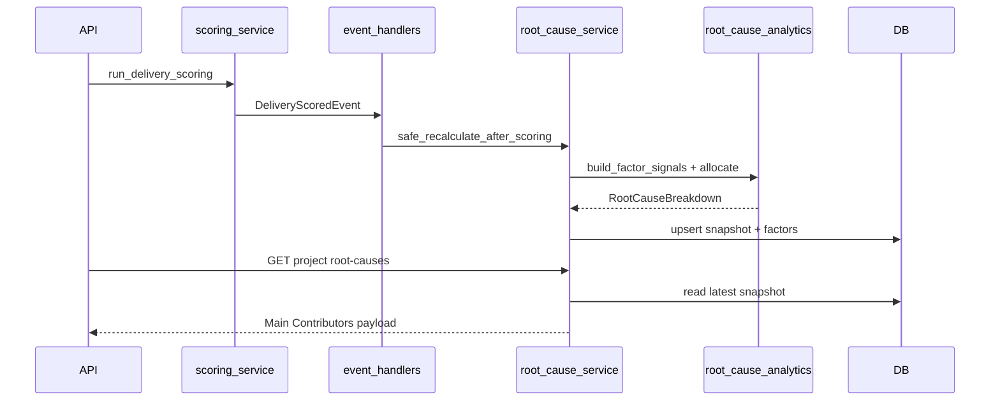

# Delivery Performance Agent — Root Cause Intelligence

**Status:** Implemented in Phase 15.1 (engine) + Phase 15.2 (operational inputs)  
**Scope:** Deterministic explanation of delivery confidence loss with configurable weights, snapshot persistence, APIs, and dashboard Main Contributors. Operational tables feed the engine; AI still must not invent causes.

## Architecture

Root-cause intelligence **explains** confidence shortfall. It does not replace Delivery confidence or risk scoring.

```text
Scoring run / POST recalculate
  → load existing signals (throughput, teams, bottlenecks, quality, milestones)
  → load DELIVERY_ROOT_CAUSE weights from metric_configurations
  → analytics/root_cause.py (pure severity + allocation)
  → upsert delivery_root_cause_snapshots + factors
  → GET APIs / Delivery dashboard Main Contributors
```



AI modules must ground narratives in stored causes (`root_cause_summary`). They never invent causes. Optional AI `daily_summary` is wired in Phase 15.4 — see [delivery-agent-operational-briefing.md](delivery-agent-operational-briefing.md).

## Formulas

```text
overall_confidence = existing confidence score_pct
confidence_loss = max(0, on_track_threshold - overall_confidence)

raw_i = weight_i × severity_signal_i   # only data_available factors with signal > 0
impact_points_i = -confidence_loss × (raw_i / sum(raw))
impact_percent_i = 100 × |impact_points_i| / confidence_loss
```

Severity bands use configurable point thresholds (`severity_medium_points`, `severity_high_points`, `severity_critical_points`).

## Cause taxonomy (15.1 + 15.2 signal mapping)

| Factor | Evidence | Notes |
|---|---|---|
| review_turnaround | Review queue snapshots (15.2) else review-titled bottlenecks | Ops override wins |
| rework | Quality rework rate | Unchanged |
| capacity | Capacity + team availability + timesheet underfill (15.2) else headcount decline | Ops override wins |
| absenteeism | Absenteeism snapshots (15.2) | Was unavailable in 15.1 |
| queue | Backlog queue snapshots (15.2) else bottlenecks + shortfall | Ops override wins |
| blocked_work | Active bottleneck severity ranks | Unchanged |
| dependency_delays | Unavailable until dependency graph | Provider stub |
| milestone_slippage | Overdue / warning-window milestones | Unchanged |
| quality_regression | Drift flag / elevated rework | Unchanged |
| scope_volatility | Unavailable until scope events | Provider stub |

Default weights (normalized to 1.0 at load): review 0.25, rework 0.20, capacity 0.15, queue 0.10, blocked_work 0.10, milestone_slippage 0.08, quality_regression 0.07, absenteeism 0.03, dependency_delays 0.01, scope_volatility 0.01.

Weights live in `metric_configurations.metric_key = delivery_root_cause` (global template + org override). No hardcoded runtime constants beyond code defaults used as fallback.

## Database

Migration: `supabase/migrations/20260720120000_delivery_root_cause_intelligence.sql`

- `delivery_root_cause_snapshots` — one row per `(project_id, snapshot_date)` with `overall_confidence`, `confidence_loss`, `model_version`, `generated_at`
- `delivery_root_cause_factors` — per-factor impact, severity, explanation, `evidence_json`
- RLS: delivery_manager ALL (own org), bsg_leadership SELECT, super_admin ALL; **no client** on raw tables

## APIs

| Method | Path | Roles |
|---|---|---|
| GET | `/delivery/root-causes` | DM, leadership, super_admin |
| GET | `/delivery/root-causes/trends` | DM, leadership, super_admin |
| GET | `/delivery/projects/{id}/root-causes` | Any authenticated user with project visibility |
| POST | `/delivery/projects/{id}/recalculate-root-causes` | DM, super_admin |

### Permissions shaping

- **Leadership / DM:** full factor list + `evidence_json` (why, calculation, affected KPIs, inputs)
- **Client:** high-level only — top contributors, no staffing factors (`capacity`, `absenteeism`), no evidence payloads

## Frontend

`frontend/src/features/delivery/root-cause/`:

- `DeliveryRootCauseSection` — Confidence + Main Contributors panel
- `RootCauseBreakdownCard` — bars + explainability drawer
- `RootCauseTrendChart` / `RootCauseTimeline` / `ImpactDistributionChart` — thin shells for trends/history

Wired into `/delivery` in place of the prior risk `contributing_causes` bar list.

## Performance

- Reads reuse latest same-day snapshot; recalculate on POST or post-scoring hook
- Org analytics cached in-process (~60s TTL); cleared on recalculate with portfolio cache
- Hook failures are isolated (`safe_recalculate_after_scoring`) so scoring persistence is not blocked

## Calculation flow

1. Load scoring thresholds + root-cause weights for the org
2. Load project scoring inputs (same path as Delivery scoring)
3. Merge Phase 15.2 operational signals via `DbOperationalSignalProvider` (fallback to 15.1 proxies when absent)
4. Build factor severity signals
5. Allocate confidence loss; persist snapshot + factors
6. Dashboard/API read snapshot; AI may consume `root_cause_summary` only

## Deferred (15.6)

| Phase | Item |
|---|---|
| 15.6 | Full Delivery dashboard redesign beyond Main Contributors |

Phase 15.2 operational ingestion: [delivery-agent-operational-data-sources.md](delivery-agent-operational-data-sources.md).  
Phase 15.3 PM daily actions: [delivery-agent-pm-daily-action-planner.md](delivery-agent-pm-daily-action-planner.md).  
Phase 15.4 operational briefing: [delivery-agent-operational-briefing.md](delivery-agent-operational-briefing.md).  
Phase 15.5 knowledge evidence: [delivery-agent-knowledge-evidence.md](delivery-agent-knowledge-evidence.md).

## Compatibility

- Existing `risk_alerts.contributing_causes` and risk formula causes remain unchanged
- Confidence/risk scoring thresholds and Phase 1–3 contracts are untouched
- Clients without snapshots see empty Main Contributors until recalculate/scoring runs
