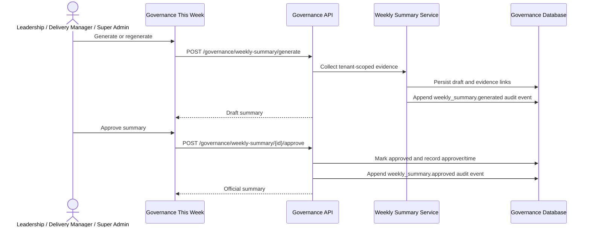

# Governance Weekly Summary

## Architecture

The Governance dashboard exposes **Governance This Week** as the third Governance tools tab beside **Ask Governance Agent** and **Project Charters**. It is backed by the existing weekly-summary API and loads only when selected, so a slow or failed summary request does not block the rest of the dashboard.

The backend collects tenant-scoped governance evidence, generates a structured Markdown draft, persists evidence links, and keeps the artifact in `draft` status. A separate approval mutation is required before the summary becomes official. Generation and approval both create append-only governance audit events.

## API contracts

- `GET /governance/weekly-summary` returns the latest visible summary or `null`.
- `GET /governance/weekly-summaries?limit=12` returns version history.
- `POST /governance/weekly-summary/generate` creates a new AI draft. The frontend includes `X-BSG-User-Action: true` and prevents duplicate submissions.
- `POST /governance/weekly-summary/{id}/approve` applies the human approval gate.
- `GET /governance/weekly-summary/{id}/export.pdf` downloads an audited PDF export.
- `GET /governance/weekly-summary/{id}/export.docx` downloads an audited Word export.
- Existing create, edit, and detail endpoints remain unchanged.

## Frontend behavior

The panel uses the same fixed-height document viewer, version selector, status metadata, Markdown rendering, and footer action pattern as Project Charters. Metadata shows the reporting week, draft/approved status, generated time and source, approver, approval time, and evidence count. PDF and DOCX controls export the selected version.

History is loaded only when expanded. Selecting a prior version never mutates it. Generation shows an inline progress state, disables all summary mutations until completion, and leaves the rest of the page interactive. Empty, loading, and error states are local to the panel.

## Permissions and client safety

- Delivery Manager access is retained for backward compatibility.
- BSG Leadership and Super Admin can generate, regenerate, review history, and approve.
- Other internal roles have read-only access when permitted by the API.
- The panel is not rendered in the client governance view. Internal summary Markdown is therefore never exposed as a client-safe escalation summary. Client-safe publishing remains a separate approval-controlled capability.

The summary permission is intentionally separate from general governance write permission. Adding Leadership to the summary workflow does not grant Leadership dependency, action, or escalation mutation rights.

## Testing strategy

Backend tests cover summary construction and the summary-specific role gate. Frontend tests cover Markdown parsing, loading, read-only empty state, generation, approval, and isolated errors. Production builds and focused backend/frontend test suites must pass before release.
