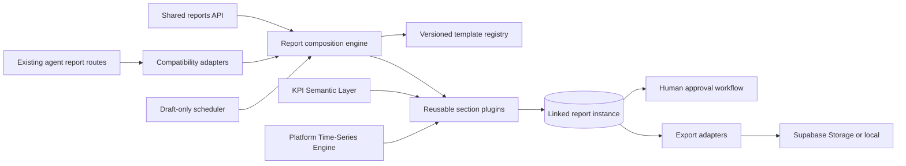

# Cross-Agent Reporting Framework (Phase 18.3)

Centralized, reusable reporting platform for Delivery, Governance, Quality, Workforce, Client, and Executive audiences. Existing domain report records remain **canonical**; shared `report_instances` are linked shadow adapters.

## Architecture



## Non-goals (Phase 18.4)

- Organization-wide AI briefings
- Autonomous email/Slack/report delivery
- Schedules that auto-approve or auto-distribute

## Data model

Migration: `supabase/migrations/20260721210000_cross_agent_reporting_framework.sql`

| Table | Purpose |
|-------|---------|
| `report_templates` | Versioned templates (global or org) |
| `report_instances` | Generated reports + source links |
| `report_evidence_refs` | Cited KPI/domain evidence |
| `report_exports` | Durable PDF/DOCX/JSON/CSV artifacts |
| `report_schedules` | Draft-only cadences |
| `report_jobs` / `_events` | Durable queue |
| `report_approval_events` | Append-only lifecycle |

Cited KPI observations receive `report_hold=true` so Phase 18.2 retention cannot prune them.

## Sections

Ordered plugins: `kpi_summary`, `trends`, `comparisons`, `forecasts`, `milestones`, `risks`, `recommendations`, `ai_executive_summary`, `charts`, `evidence`, `appendix`.

Analytics come from KPI evaluate + time-series APIs; AI narrative sections are deterministic/governed and **always require human approval**.

## Workflow

`draft → in_review → approved|rejected → distributed`

- Approve ≠ distribute (and ≠ send for client communications)
- Schedules create **drafts only**
- Ready-for-review notifies via `communication_pending`

## APIs

Prefix: `/api/v1/reports`

- Templates: `GET/POST /templates`, `PATCH /templates/{id}`, activate/archive
- Generation: `POST /generate` (202 job), `POST /generate/sync`, `POST /{id}/regenerate`
- Lifecycle: submit / approve / reject / distribute
- Exports: `POST /{id}/exports/{format}`, list, download
- Schedules: list/create/patch
- History/preview/approvals

Existing communications and Governance export routes remain compatibility facades.

## Frontend

- Types/client/hooks: `frontend/src/types/reports.ts`, `lib/api/reports.ts`, `lib/queries/reports.ts`
- Shared UI: `frontend/src/components/bsg/reports/`
- Adoption: optional `platformReportId` on PM `ReportWorkspacePanel` for shared exports

## Configuration

| Setting | Default |
|---------|---------|
| `REPORT_JOBS_ENABLED` | `true` |
| `REPORT_PUBLISH_ENABLED` | `true` |
| `REPORT_JOB_POLL_INTERVAL_SECONDS` | `30` |
| `REPORT_PLAN_INTERVAL_SECONDS` | `3600` |
| `REPORT_EXPORT_DIR` | `backend/data/report-exports` |
| `REPORT_STORAGE_BACKEND` | `local` (`supabase` supported) |
| `REPORT_STORAGE_BUCKET` | `report-exports` |

## Package layout

```
backend/app/reports/
  engine.py workflows.py jobs.py scheduler.py storage.py
  registry.py adapters.py permissions.py exports.py
  sections/ exporters/
```

## Future-agent contract

1. Register a template row (or seed) with ordered `section_config`.
2. Call `POST /api/v1/reports/generate` or `build_report(...)`.
3. Link domain rows with `source_*` fields via adapters.
4. Require human approval before any client-visible distribution.
5. Prefer KPI/time-series sections over duplicated formulas.

## Compatibility adapters

Domain records remain canonical. Shared instances are linked shadows:

| Domain source | Template key(s) | Link field |
|---|---|---|
| `client_communications` | `client.weekly_status` / `executive.status_summary` | `source_communication_id` |
| `governance_weekly_summaries` | `governance.weekly_summary` | `source_weekly_summary_id` |
| `project_charters` | `governance.charter` | `source_charter_id` |
| `governance_recommendation_evaluation_reports` | `governance.evaluation` | `source_evaluation_report_id` |
| Delivery operational briefings (ephemeral) | `delivery.health_summary` | `source_table=delivery_operational_briefings` |
| Quality / Workforce | `quality.weekly_quality` / `workforce.utilization_summary` | generated via shared engine |

Historical backfill: report job type `backfill` runs `backfill_historical_reports` (communications, weekly summaries, charters, evaluation reports).

Communication detail and Governance weekly summary reads expose optional `platform_report_id` for shared export UI.
