# Platform Time-Series Engine (Phase 18.2)

Append-only, version-aware KPI history built on the Phase 18.1 Semantic Layer.

## Architecture

```mermaid
flowchart LR
  AgentEvents[Agent score and recommendation events] --> SnapshotQueue[Durable snapshot queue]
  Scheduler[UTC schedule planner] --> SnapshotQueue
  EvaluateApi[KPI evaluate POST] --> Evaluator[Version-aware KPI evaluator]
  SnapshotQueue --> Hydrators[Scope and as-of input hydrators]
  Hydrators --> Evaluator
  Evaluator --> ObservationWriter[Append-only observation writer]
  ObservationWriter --> Raw[(KPI and score observations)]
  AgentEvents --> RecommendationTimeline[(Recommendation timeline events)]
  Raw --> RollupWorker[Rollup and retention worker]
  RollupWorker --> Rollups[(Daily weekly monthly quarterly rollups)]
  Raw --> Analytics[Trend comparison and forecast services]
  Rollups --> Analytics
  Analytics --> SharedApi[Shared time-series APIs]
  SharedApi --> SharedUi[Reusable frontend components]
```



## Data model

Migration: `supabase/migrations/20260721180000_platform_time_series_engine.sql`

| Table | Purpose |
|-------|---------|
| `kpi_observations` | Immutable KPI evaluations (extended) |
| `agent_score_observations` | Versioned non-KPI agent scores |
| `kpi_observation_rollups` | Daily/weekly/monthly/quarterly aggregates |
| `kpi_snapshot_schedules` | UTC collection schedules |
| `time_series_snapshot_jobs` / `_events` | Durable queue with SKIP LOCKED |
| `recommendation_timeline_events` | Append-only recommendation lifecycle index |

Observations are **never updated**. Corrections append a new row with `supersedes_observation_id`. RLS allows INSERT/SELECT only for application roles; retention deletes are service-role only.

`department_key` is derived from `Project.vertical` (no department table exists).

## Lifecycle

1. **Event-driven**: Delivery scoring, Quality snapshot evaluation, Workforce utilization writes, Governance lifecycle, Knowledge apply/dismiss, mitigation accept/reject append observations and/or timeline events.
2. **Scheduled**: Planner enqueues jobs from `kpi_snapshot_schedules`; poller claims with `FOR UPDATE SKIP LOCKED`, heartbeats, retries with backoff.
3. **Evaluate API**: `POST /api/v1/kpis/{id}/evaluate` with `persist_observation: true` writes history. Dashboard GETs never persist or forecast.
4. **Rollups**: Prefer rollups for series reads when available.
5. **Retention (balanced)**:
   - Raw non-protected observations: **400 days**
   - Daily rollups: **3 years**
   - Monthly/quarterly rollups: **indefinite**
   - Legal/audit/report holds are never pruned

## Aggregation and forecasting

- Trends return absolute/percentage change, raw direction, and **semantic favorability** (`higher_is_better` / `lower_is_better` / `target_range`).
- Forecasts use deterministic OLS linear trend with moving-average fallback. No LLMs, no heavy ML deps, no automatic actions.
- Hard caps: max date range 400 days, max series points 366, forecast horizon ≤ 12, minimum history ≥ 5.

## Recommendation timeline

Shared table is a **read model / event index**, not a second recommendation repository. It references Governance lifecycle events, mitigation recommendations, and Knowledge suggestions. Idempotent Governance backfill: `backfill_governance_lifecycle(...)`.

## APIs

| Method | Path |
|--------|------|
| GET | `/api/v1/kpis/{kpi_key}/history` |
| GET | `/api/v1/kpis/{kpi_key}/latest` |
| GET | `/api/v1/kpis/{kpi_key}/trend` |
| GET | `/api/v1/kpis/{kpi_key}/series` |
| GET | `/api/v1/kpis/{kpi_key}/compare` |
| GET | `/api/v1/kpis/{kpi_key}/forecast` |
| GET | `/api/v1/time-series/dimensions` |
| GET | `/api/v1/time-series/recommendations` |
| GET | `/api/v1/time-series/recommendations/{subject_id}/timeline` |

Filters: org/project/client/department/agent, date range, interval, definition/calculator version. RBAC: KPI catalog visibility, project assignment, tenant scope. Clients cannot read recommendation timelines.

### Example

```http
GET /api/v1/kpis/quality.gold_set_accuracy/trend?project_id=<uuid>&rolling_window=7
Authorization: Bearer <token>
```

```http
POST /api/v1/kpis/delivery.confidence/evaluate
Content-Type: application/json

{
  "project_id": "<uuid>",
  "version": "1.0.0",
  "persist_observation": true
}
```

## Frontend

- Types: `frontend/src/types/time-series.ts`
- Client: `frontend/src/lib/api/time-series.ts`
- Hooks: `frontend/src/lib/queries/time-series.ts`
- Components: `frontend/src/components/bsg/time-series/`
- Chart theme: `frontend/src/lib/charts/theme.ts` (Quality `format.ts` re-exports for compatibility)

Reference adoption: Quality trend chart and Operational Tower lazy `DashboardCharts` use shared `KpiTrendChart` with domain data as fallback until persisted history is sufficient.

## Configuration

| Setting | Default | Meaning |
|---------|---------|---------|
| `TIME_SERIES_JOBS_ENABLED` | `true` | Planner + queue poller |
| `TIME_SERIES_PUBLISH_ENABLED` | `true` | Event-driven observation writes |
| `TIME_SERIES_RETENTION_ENABLED` | `true` | Nightly prune |
| `TIME_SERIES_JOB_POLL_INTERVAL_SECONDS` | `30` | Queue poll interval |
| `TIME_SERIES_PLAN_INTERVAL_SECONDS` | `3600` | Schedule planner interval |
| `TIME_SERIES_RETENTION_CRON_HOUR_UTC` | `3` | Retention cron hour (UTC) |

## Observability

Structured logs (no sensitive KPI values): `kpi_observation_persisted`, `kpi_observation_duplicate_skipped`, `time_series_job_*`, `kpi_rollups_generated`, `kpi_retention_prune`, `kpi_forecast_*`, `recommendation_timeline_appended`.

## Future-agent publication contract

```python
from app.time_series.observations import persist_kpi_observation, publish_agent_score
from app.kpis.evaluation import evaluate_kpi

# Prefer evaluate + persist for semantic KPIs
await evaluate_kpi(session, user, "my_agent.kpi", version="1.0.0", persist_observation=True, source_type="agent_event")

# Non-KPI scores
await publish_agent_score(session, org_id=..., score_key="my_agent.score", agent_key="my_agent", numeric_value=...)
```

Do not overwrite historical rows. Do not recalculate past observations with a newer definition version. Do not run collection/forecast on dashboard GET paths.

## Package layout

```
backend/app/time_series/
  observations.py   # sole writer
  hydrators.py      # via app.kpis.hydrators
  aggregation.py
  forecasting.py
  rollups.py
  retention.py
  jobs.py
  scheduler.py
  recommendations.py
  publishers.py
```
